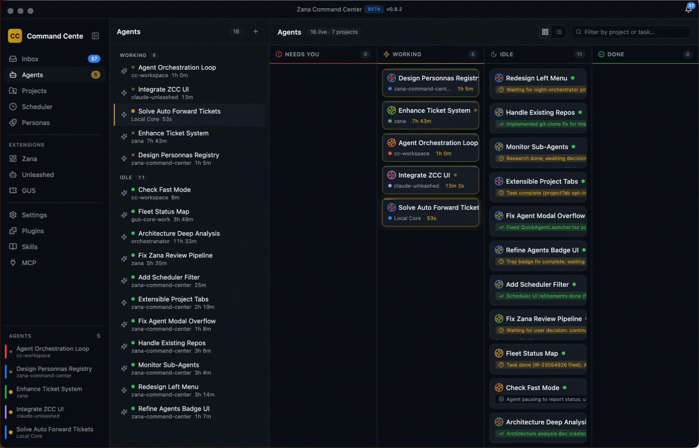

# Zana Command Center

**A desktop control center for running, coordinating, and reviewing AI coding agents across your projects.**

Zana Command Center is an Electron app for managing many local and remote coding-agent sessions from one workspace. Launch real CLI sessions in project directories, see what needs attention, coordinate agents and teams, automate repeatable work, and retain the results in an Inbox and Library.



<p align="center">
  <a href="https://github.com/salesforce/zana/releases/latest">
    
  </a>
</p>

<p align="center"><sub>macOS build</sub></p>

## Install

Download and open the `.dmg` from the [latest GitHub Release](https://github.com/salesforce/zana/releases/latest). Release artifacts include the update feed used by the app's in-app updater.

### Build from source

```bash
git clone https://github.com/salesforce/zana.git
cd zana
npm install
npm run rebuild
npm run dev
```

**Prerequisites:** Node.js 20 or newer, `git`, and at least one supported coding-agent CLI for the sessions you intend to run. Zana can verify configured harnesses from the app.

## What You Can Do

- **Run coding agents in parallel.** Launch real PTY sessions for Claude Code, Cursor, Codex, Pi, OpenCode, or a plain shell. Choose the CLI, model, and execution mode per persona or launch.
- **Work across local and remote projects.** Keep local folders and SSH projects in one workspace, each with its own terminals, agents, explorer, settings, and project-scoped views.
- **Monitor the agent fleet.** Use Home, the Agents board, activity feeds, and notifications to find working, idle, blocked, and completed sessions without hunting through terminal tabs.
- **Coordinate human decisions.** Agents can publish reports, questions, and other results to the Inbox. Reply from an Inbox question to route an answer back to the waiting session. Follow-ups preserve decisions that need human input.
- **Organize reusable work.** Define personas, squads, and goals; run autonomous goal loops with explicit success criteria; save durable notes, findings, and reports in the cross-project Library.
- **Automate recurring tasks.** Schedule agent runs, review their run reports, and use configurable automation such as idle-agent cleanup and overseer workflows.
- **Resume and preserve sessions.** Reopen supported agent transcripts, retain session context, and optionally use tmux-backed persistence for local and remote sessions.
- **Review artifacts in context.** Browse files, terminal output, Markdown, Mermaid diagrams, diffs, attachments, and reports without leaving the application.
- **Control the app from a terminal.** The `zcc` CLI can inspect projects, personas, teams, schedules, and Inbox entries offline; with the app running, it can inspect and control live agents, terminals, and schedules.

## Core Surfaces

| Surface | Purpose |
| --- | --- |
| **Home** | Workspace-wide view of active agents, open follow-ups, unread Inbox activity, and quick agent launch. |
| **Projects** | Local and SSH project registry, file explorer, project tabs, skills, settings, and scoped agent work. |
| **Terminals** | Tabbed PTY sessions for supported coding CLIs and shell workflows. |
| **Agents** | Global and project boards for live state, session details, reports, transcripts, usage, and bulk actions. |
| **Inbox and Notifications** | Questions, reports, saved deliverables, and links to the relevant project or extension view. |
| **Goals and Follow-ups** | Autonomous objectives with verification criteria plus durable questions that survive agent restarts. |
| **Personas and Teams** | Reusable agent roles, model and provider routing, and multi-agent team definitions that can be imported or exported. |
| **Scheduler** | Recurring agent tasks, templates, run history, and per-run reports. |
| **Library** | Cross-project folders and documents for durable technical knowledge and agent-authored findings. |
| **Extensions** | Permission-gated modules that add panels, project tabs, commands, capabilities, skills, MCP servers, and personas or teams. |

## Extensions

Zana is extensible through [`@zana-ai/zcc-extension-sdk`](packages/extension-sdk). Disk extensions are discovered at runtime, run in isolated utility processes, and receive only the capabilities granted through explicit, scoped user consent. First-party features can use the same extension path.

Extensions can contribute sidebar or project-tab panels, command-palette commands, notifications, main-side capabilities, personas, teams, skills, and MCP server definitions. You can also create a local extension from within Zana and iteratively build and reload it in a dedicated project.

- **Overview:** [`docs/extensions.md`](docs/extensions.md)
- **Authoring guide:** [`docs/extensions-authoring.md`](docs/extensions-authoring.md)
- **SDK reference:** [`docs/extensions-sdk-reference.md`](docs/extensions-sdk-reference.md)
- **Starter:** [`tools/create-zcc-extension`](tools/create-zcc-extension)

## CLI

`zcc` is the app's command-line companion. Read commands work from the persisted Zana stores whether or not the desktop app is running. Live commands use the running app's authenticated local control plane to list or message agents, launch work, manage terminals, and trigger or toggle schedules.

```bash
# Build the CLI from this repository
npm run build:cli

# List registered projects
node packages/cli/dist/bin/zcc.js projects ls

# Launch an agent through a running Zana instance
node packages/cli/dist/bin/zcc.js run my-project "review the current diff" --persona reviewer
```

See the complete [`zcc` CLI reference](docs/cli.md).

## Stack

Electron 33, electron-vite, React 18, Zustand, xterm.js, node-pty, SQLite, cron scheduling, an extension SDK, and optional tmux-backed session persistence.

## Data and Security

Zana stores its user-managed state under `~/.zcc/`, including the project registry, configuration, personas, teams, schedules, Inbox entries, Library documents, and extensions.

The desktop app is the authorization boundary: project paths, remote operations, extension capabilities, and live CLI actions are validated in the main process. Extensions are deny-by-default and receive only consented, scoped capabilities.

## Development

```bash
npm run typecheck
npm test
npm run build
```

For end-to-end tests, run `npm run test:e2e`.
