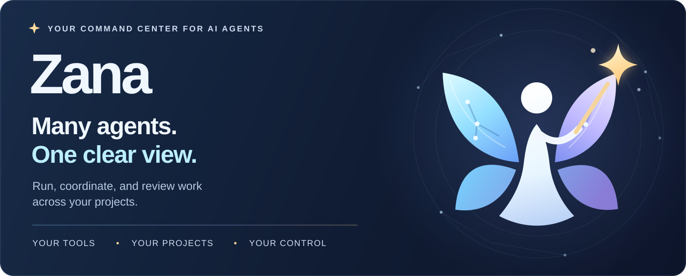
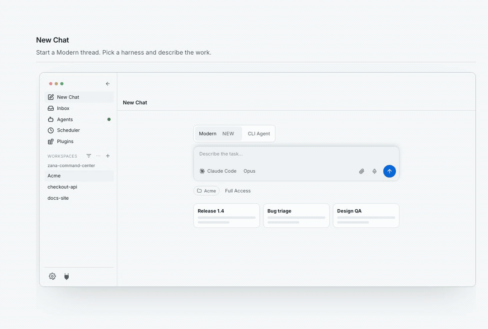
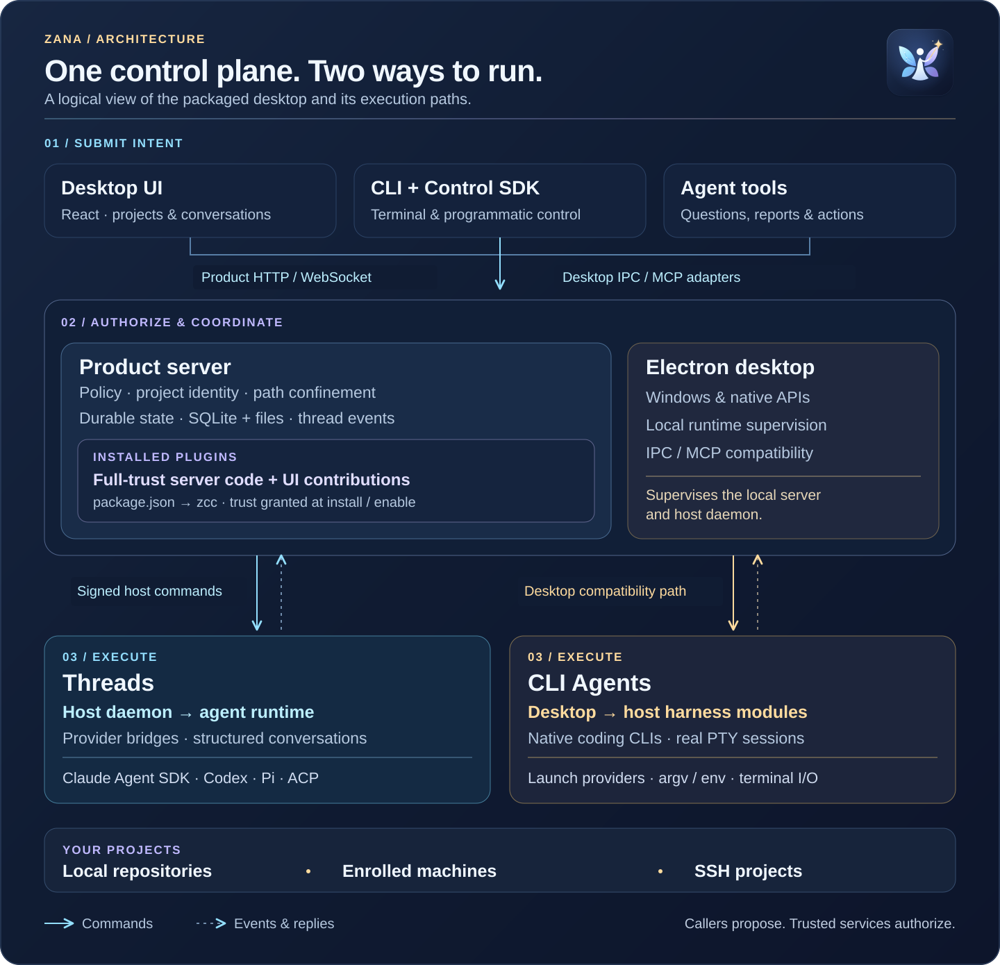
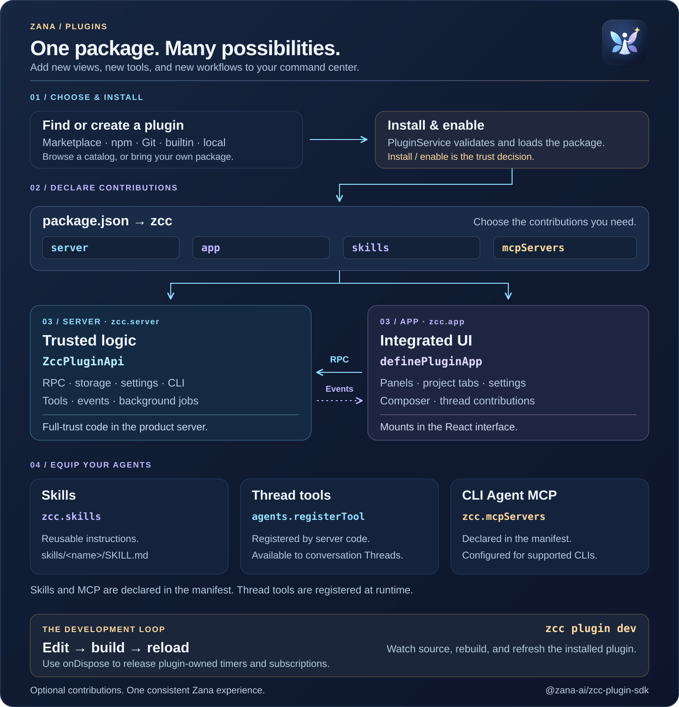

<p align="center">
  <a href="https://zana-ide.com/">
    
  </a>
</p>

<h1 align="center">Zana</h1>

<p align="center">
  <strong>Your command center for AI coding agents.</strong><br>
  Bring your tools, connect your projects, and keep the work moving.
</p>

<p align="center">
  <a href="https://github.com/salesforce/zana/releases/latest"></a>
  <a href="https://zana-ide.com/"></a>
  <a href="LICENSE.txt"></a>
</p>

<p align="center">
  <a href="#get-started">Get started</a> ·
  <a href="#built-for-the-way-you-work">Features</a> ·
  <a href="#how-zana-fits-together">Architecture</a> ·
  <a href="#make-it-yours">Plugins</a> ·
  <a href="#develop-zana">Development</a>
</p>

---

Zana brings your coding agents into one desktop app. Start a conversation,
launch a native CLI session, or coordinate a team across projects. See what is
working, what needs your attention, and what is ready to review.

Questions arrive in your **Inbox**. Findings live in your **Library**. Proven
ways of working become reusable **personas, teams, goals, and schedules**.

<p align="center">
  <a href="https://zana-ide.com/">
    
  </a>
  <br>
  <sub>From the first prompt to the finished work, in one place.</sub>
</p>

## Built for the way you work

| Run your agents | Stay in control |
| :--- | :--- |
| **Your agents, together**<br>Use Claude Code, Codex, Cursor, OpenCode, and Pi. Choose structured Threads or a real terminal with CLI Agents. | **Every project in view**<br>Work across local repositories, enrolled machines, and SSH projects, with files and sessions in context. |
| **A clear view of the fleet**<br>See which agents are working, idle, done, or waiting for you. Open the session that needs attention. | **Decisions that keep work moving**<br>Receive questions and reports in the Inbox, then send your answer back to the waiting agent. |
| **Work you can repeat**<br>Reuse personas and teams, pursue goals with success criteria, and schedule recurring tasks with per-run reports. | **Knowledge that stays with you**<br>Keep findings in the Library. Review Markdown, diagrams, diffs, and attachments alongside the work. |

### From intent to outcome

1. **Connect a project.** Add a local folder, an enrolled machine, or an SSH project.
2. **Start the work.** Open **New Chat**, choose a Thread, CLI Agent, or Team, and give it a task.
3. **Stay in the loop.** Watch the Agents board and answer questions from the Inbox.
4. **Keep what matters.** Review the result, save the findings, and reuse the workflow.

## Get started

**[Download Zana for macOS →](https://github.com/salesforce/zana/releases/latest)**

Choose the `.dmg` for **Apple Silicon** or **Intel**, install Zana, and add your
first project. Releases are signed and notarized; the app checks for updates
and applies downloaded updates when you quit.

You’ll need **Node.js 20+**, **Git**, and the coding-agent CLI you want to use
installed and authenticated. Use **Node.js 22+** for remote execution hosts
and source development.

[First-run guide](docs/getting-started.md) ·
[Daily workflows](docs/using-zana.md) ·
[Multiple machines](docs/multiple-devices.md)

## How Zana fits together

The desktop UI, `zcc` CLI, and agent tools connect to Zana’s product services.
The **product server** owns policy, projects, thread state, and the plugin
host. **Host execution** runs the authorized work on your machines. Electron
provides the desktop shell, supervises the local runtime, and retains
compatibility adapters for native and CLI Agent operations.

[](docs/assets/zana-architecture.svg)

| Execution surface | How it runs |
| :--- | :--- |
| **Threads** | Structured conversations through the host daemon, agent runtime, and provider bridges: Claude Agent SDK, Codex app-server, Pi SDK, and ACP. |
| **CLI Agents** | Native coding CLIs in real PTYs, using the desktop launch path and host harness modules. Shell terminals use PTYs too. |

The renderer supplies intent; trusted server and desktop services authorize
operations and confine paths. Installed plugins run **full-trust inside the
product server** and can contribute UI. Install and enable are the trust
decisions; plugins are not sandboxed guests.

[Architecture guide](docs/architecture/high-level-architecture.md) ·
[Runtime boundaries](docs/architecture/runtime-monorepo.md) ·
[Editable diagram and exports](docs/assets/README.md)

## Make it yours

Add panels, project tabs, agent tools, skills, MCP servers, settings, and CLI
commands through **Plugins**. Browse the in-app catalog or build your own
TypeScript package with the [`@zana-ai/zcc-plugin-sdk`](packages/plugin-sdk).

A plugin’s `package.json` declares the pieces it contributes: **server logic**,
**interface elements**, and **agent capabilities**. Zana loads those pieces
and connects them through the SDK.

[](docs/assets/zana-plugins.svg)

```bash
zcc plugin new hello --app
cd zcc-plugin-hello
zcc plugin install .
zcc plugin dev
```

You can also choose **Create** in **Plugins → Browse** to start inside Zana.
The development loop watches your source, rebuilds the UI, and reloads the
installed plugin as you edit.

[How plugins work](docs/extensions.md) ·
[Plugin quickstart](docs/extensions-quickstart.md) ·
[Authoring guide](docs/extensions-authoring.md) ·
[SDK reference](docs/extensions-sdk-reference.md)

### Work from your terminal

The `zcc` CLI and [Control SDK](docs/control-sdk.md) let you operate the running
app from scripts and your terminal. With `zcc` on your `PATH`:

```bash
# Find a registered project
zcc project list

# Start a Thread in that project
zcc thread spawn --project <project-id> --prompt "Review the current diff"

# See your running Threads
zcc thread list
```

Live commands use the app’s authenticated control APIs. Selected commands,
including `zcc guide`, plugin scaffolding, and Inbox file reads, also work
offline. See the [CLI reference](docs/cli.md) for installation and all commands.

## Develop Zana

Use **Node.js 22+** and the **pnpm version pinned in `package.json`**.

```bash
git clone https://github.com/salesforce/zana.git
cd zana
pnpm install
pnpm run rebuild
pnpm dev
```

Development uses `~/.zcc-dev` and port `8781`, so it can run alongside your
installed app. The pre-dev step builds the CLI and seeds bundled plugins.

<details>
<summary><strong>Packaged builds and CLI connections</strong></summary>

To build and run the packaged desktop app, quit any other Zana instance using
`~/.zcc` first:

```bash
pnpm dist
pnpm start
```

`pnpm start` opens the built app from `dist/`; it does not rebuild.
`pnpm preview` runs unpackaged production Electron from `out/`.
`pnpm dev:prod` points development at `~/.zcc` on port `8780`; quit the
installed app before using it. Use that command rather than `pnpm dev --prod`,
which is pnpm’s production-dependencies flag.

Build and run the CLI directly from this checkout:

```bash
pnpm build:cli
node packages/cli/dist/bin/zcc.js project list
```

To target the isolated development app:

```bash
ZCC_DATA_DIR="$HOME/.zcc-dev" ZCC_SERVER_URL=http://127.0.0.1:8781 \
  node packages/cli/dist/bin/zcc.js project list
```

Without overrides, the CLI targets the installed app’s data in `~/.zcc`
and product API on port `8780`.

</details>

### Repository map

| Path | Responsibility |
| :--- | :--- |
| [`apps/app`](apps/app) | React interface: projects, conversations, fleet views, and plugin surfaces. |
| [`apps/server`](apps/server) | Product APIs, policy, durable state, and the plugin host. |
| [`apps/host-daemon`](apps/host-daemon) | Agent execution, provider bridges, PTY harnesses, and host filesystem operations. |
| [`apps/desktop`](apps/desktop) | Electron shell, native integration, runtime supervision, and compatibility IPC. |
| [`packages`](packages) | Shared contracts, agent runtime, SDKs, CLI, and UI primitives. |
| [`plugins`](plugins) | First-party plugins and provider integrations. |
| [`website`](website) | Public website, documentation, and marketplace. |

### Checks

```bash
pnpm typecheck
pnpm test
pnpm build
pnpm test:e2e
```

See [CONTRIBUTING.md](CONTRIBUTING.md) for the contribution workflow and
[e2e/README.md](e2e/README.md) for end-to-end testing.

## Open source, yours to shape

Zana is **[MIT-licensed](LICENSE.txt)**. Fork it, adapt the interface, add your
own integrations, and build around the tools and environments your team uses.
Contributions to code, documentation, tests, and issue reports are welcome.

Zana’s architecture builds on the work of **[bb](https://github.com/get-bb/bb)**.
We also draw inspiration from Cursor, Codex, and Claude Code.

<p align="center">
  <a href="https://zana-ide.com/">Website</a> ·
  <a href="https://github.com/salesforce/zana/issues">Issues</a> ·
  <a href="CONTRIBUTING.md">Contributing</a> ·
  <a href="SECURITY.md">Security</a> ·
  <a href="CODE_OF_CONDUCT.md">Code of conduct</a>
</p>
