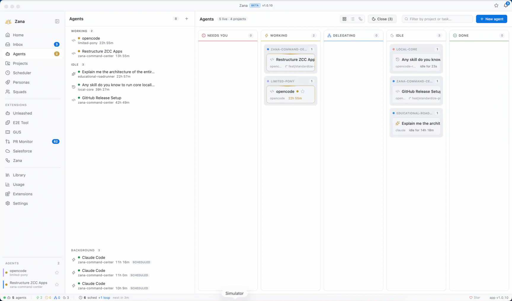
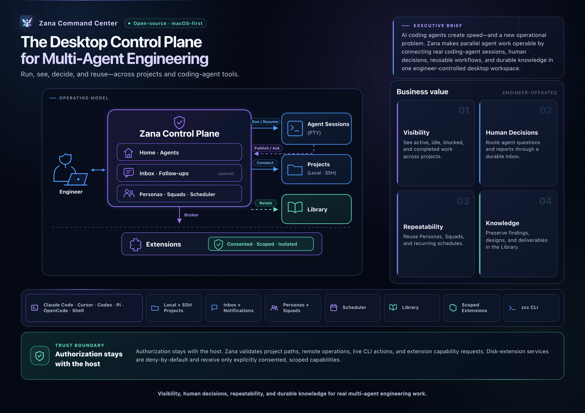

# Zana Command Center

<p align="center">
  <a href="https://github.com/salesforce/zana/releases/latest">
    
  </a>
  <a href="https://github.com/salesforce/zana/blob/main/LICENSE.txt">
    
  </a>
</p>

Zana Command Center is a desktop control plane for running, coordinating, and
reviewing AI coding agents across your projects. **New Chat** starts a Thread
with the coding CLI you already use (CLI Agent is a real PTY when you want
it), then gives you one place to see the fleet, answer questions, reuse proven
workflows, and retain the outcome.

Work is not trapped in terminal scrollback. Agents can publish questions,
reports, and durable artifacts to an Inbox and Library; you can answer or steer
them without hunting for the right session. Local repositories, enrolled
machines, SSH projects, the desktop app, and the `zcc` CLI remain first-class
ways to operate the same workspace.

> [!NOTE]
> Zana is macOS-first. Signed and notarized releases are available for Apple
> Silicon and Intel Macs. You need Node.js 20 or newer, `git`, and at least one
> supported coding-agent CLI on your `PATH`.

<p align="center">
  
</p>

## Use Zana

### Download the desktop app

The recommended way to start is the desktop app:

**[Download the latest Zana release](https://github.com/salesforce/zana/releases/latest)**

Open the architecture-matched `.dmg` for your Mac. Zana checks the public GitHub
release feed for signed updates and installs a downloaded update the next time
you quit the app.

### Build from source

```bash
git clone https://github.com/salesforce/zana.git
cd zana
pnpm install
pnpm run rebuild
pnpm dev
```

`pnpm dev` launches the Electron development app. The pre-dev step builds the
`zcc` CLI and seeds bundled plugins automatically.

## The Operating Loop

1. **Connect real work.** Register a local repository, an enrolled machine, or
   an SSH-hosted project.
2. **Launch the right agent.** From New Chat, start a Thread (or CLI Agent)
   with Claude Code, Cursor, Codex, Pi, OpenCode, or a shell — with the relevant
   persona, model, and execution mode.
3. **Operate the fleet.** See which sessions need you, are working, idle, or done
   instead of checking every terminal tab.
4. **Keep decisions moving.** Agents publish questions, reports, and artifacts to
   the Inbox; answer an Inbox question to route your response back to the waiting
   session.
5. **Turn output into leverage.** Save findings in the Library and turn successful
   roles and workflows into personas, teams, goals, or schedules.

## What Zana Provides

- **Real coding harnesses, not a replacement chat shell.** New Chat defaults to
  a Thread; CLI Agent runs a native PTY for Claude Code, Cursor, Codex, Pi,
  OpenCode, and plain-shell workflows.
- **One workspace for many environments.** Manage local folders, enrolled
  machines, and SSH projects with their own terminals, agents, explorer,
  settings, and scoped views.
- **An operational agent board.** Use Home, Agents, activity feeds, and
  notifications to find work that needs attention quickly.
- **Durable human-agent handoffs.** The Inbox, reports, and Follow-ups keep
  decisions and deliverables visible after an agent or terminal has ended.
- **Repeatable multi-agent work.** Define personas and teams, run goals with
  success criteria, and schedule recurring tasks with per-run reports.
- **Contextual engineering artifacts.** Browse files, terminal output, Markdown,
  Mermaid diagrams, diffs, attachments, and reports without leaving the app.
- **Terminal control when you prefer it.** The `zcc` CLI reads persisted data while
  offline and can control live agents, terminals, and schedules through the
  running app's authenticated local control plane.

## Architecture at a Glance



## Core Surfaces

| Surface | Purpose |
| --- | --- |
| **Home** | New Chat composer (Thread, CLI Agent, Autonomous Team), active work, and quick launch. |
| **Projects** | Local, enrolled-machine, and SSH project registry, file explorer, project tabs, skills, settings, and scoped agent work. |
| **Terminals** | Tabbed PTY sessions for supported coding CLIs and shell workflows. |
| **Agents** | Global and project boards for live state, session details, reports, transcripts, usage, and bulk actions. |
| **Inbox and Notifications** | Questions, reports, saved deliverables, and links to the relevant project or plugin view. |
| **Goals and Follow-ups** | Autonomous objectives with verification criteria plus durable questions that survive agent restarts. |
| **Personas and Teams** | Reusable agent roles, model and provider routing, and multi-agent team definitions that can be imported or exported. |
| **Scheduler** | Recurring agent tasks, templates, run history, and per-run reports. |
| **Library** | Cross-project folders and documents for durable technical knowledge and agent-authored findings. |
| **Plugins** | Installed TypeScript packages (`package.json` `zcc`) that add panels, project tabs, skills, MCP servers, settings, and CLI commands. |

## Plugins

Zana is extensible through [`@zana-ai/zcc-plugin-sdk`](packages/plugin-sdk). A plugin is a TypeScript package whose `package.json` carries a `zcc` block. After install it is full-trust in-process code on the server and registers UI with `definePluginApp`. Scaffold with `zcc plugin new <name>` or **Create** in Plugins → Browse.

- **Overview:** [`docs/extensions.md`](docs/extensions.md)
- **Authoring guide:** [`docs/extensions-authoring.md`](docs/extensions-authoring.md)
- **SDK reference:** [`docs/extensions-sdk-reference.md`](docs/extensions-sdk-reference.md)
- **Quickstart:** [`docs/extensions-quickstart.md`](docs/extensions-quickstart.md)

## CLI

`zcc` is the app's command-line companion. Read commands work from the persisted Zana stores whether or not the desktop app is running. Live commands use the running app's authenticated local control plane to list or message agents, launch work, manage terminals, and trigger or toggle schedules.

```bash
# Build the CLI from this repository
pnpm build:cli

# List registered projects
node packages/cli/dist/bin/zcc.js projects ls

# Launch an agent through a running Zana instance
node packages/cli/dist/bin/zcc.js run my-project "review the current diff" --persona reviewer
```

See the complete [`zcc` CLI reference](docs/cli.md).

## Fork It. Make It Yours.

Zana is MIT-licensed end to end. Fork the repository, tailor the agent harnesses,
personas, plugins, tools, and interface to your engineering practice, then
build and distribute your own version. Zana remains desktop-first: your team can
operate its own build with the coding-agent CLI subscriptions and local or SSH
environments it already uses.

## Further Reading

- [Getting started](docs/getting-started.md) for the first project-to-agent loop.
- [Using Zana](docs/using-zana.md) for the day-to-day Inbox, Agents, Teams, and Scheduler workflows.
- [Plugin authoring](docs/extensions-authoring.md) for `package.json` `zcc`, `definePluginApp`, and `ZccPluginApi`.

## Development

```bash
pnpm typecheck
pnpm test
pnpm build
```

For end-to-end tests, run `pnpm test:e2e`.

## Acknowledgements

Zana’s architecture is rebased on the awesome [bb](https://github.com/get-bb/bb) IDE.
We also drew inspiration from bb, Cursor, Codex, and Claude Code.

## Contributing

Contributions to code, documentation, tests, and issue reports are welcome. See
[CONTRIBUTING.md](CONTRIBUTING.md) for the contribution workflow and
[SECURITY.md](SECURITY.md) for private vulnerability reporting.
