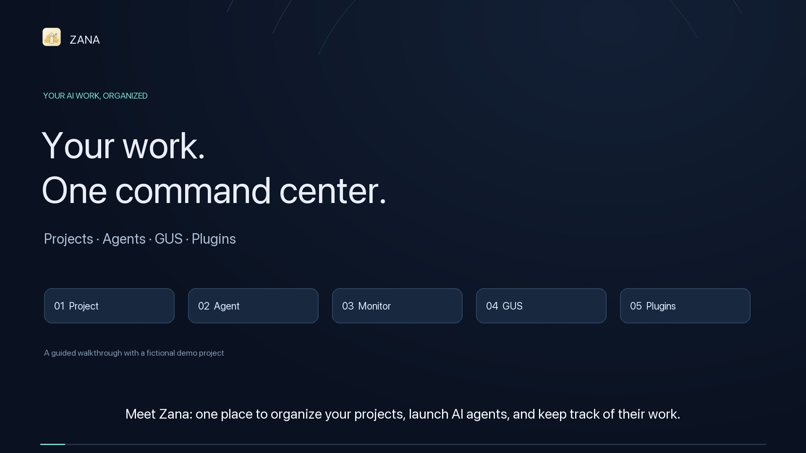

# Zana demo video

**2:27 · 1080p · English narration · captions included**

[Download or play the MP4](Zana-demo.mp4) · [Local player with chapters](watch.html) · [Subtitles](captions.srt)

## Covered workflows

- 0:00 — Welcome to Zana
- 0:12 — Create a project
- 0:28 — Launch an agent
- 0:54 — Monitor the work
- 1:24 — Follow your GUS tickets
- 1:47 — Create your own plugins
- 2:16 — Start with a goal

## Sharing

Share `Zana-demo.mp4` directly. It uses H.264 video and AAC audio and includes captions in the picture. `Zana-demo-share.zip` includes the video, thumbnail, subtitles, narration, and local player. Extract the archive before opening `watch.html`.

Suggested message:

> A quick tour of Zana: create a project, launch an AI agent, monitor its progress, follow your GUS tickets, and build custom plugins.

## Production notes

- Actual app captures for the project, agent, monitoring, and plugin workflows. Edited still captures use gentle motion and close-ups; this is not an uninterrupted screen recording.
- The task-dashboard agent really created `PLAN.md` in `/Users/Shared/zana-demo-project`.
- GUS data regions were reconstructed with fictional ticket titles, identities, and discussion. Those scenes are labeled "Illustrative ticket data".
- The plugin segment demonstrates the current New plugin prompt and the Plugin Guide. It does not claim that the example plugin has been installed or published.
- English narration was generated locally with the macOS Samantha voice. No music or external stock assets.
- No live ticket data, personal browser chrome, credentials, or private filesystem paths are present in the distributed video or share bundle.

## Validation

- Full video decode completed without errors.
- 1920 × 1080, 24 fps, H.264 video, AAC audio, fast-start MP4.
- Captions were timed to each spoken phrase, with SRT and WebVTT sidecars.
- Checked representative rendered frames across the walkthrough, including both reconstructed GUS scenes.

The production scripts and sanitized stills are retained in this folder for edits. Original captures with personal browser chrome or live ticket content were removed after sanitization.
