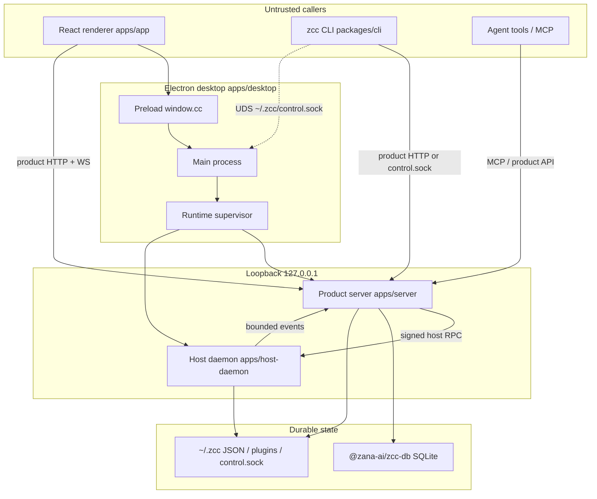

# Zana Command Center — high-level architecture

**Date:** 2026-08-28  
**Scope:** Product architecture as implemented in this monorepo (pnpm workspace, Electron desktop).  
**Related:** [runtime-monorepo.md](./runtime-monorepo.md) (migration contract), [self-development.md](./self-development.md) (plugin loop), [plugin-system-plan.md](./plugin-system-plan.md), [docs/extensions.md](../extensions.md), [docs/harness-sdk-architecture.md](../harness-sdk-architecture.md).

This note describes how the running system is split, who is trusted, and how work flows from UI to agents. It does not replace the migration contract or SDK references.

---

## What the product is

Zana Command Center is a **desktop control plane** for AI coding agents. Users register projects (local folders, enrolled machines, SSH), start **Threads** (structured agent sessions) or **CLI Agents** (real PTYs for Claude Code, Cursor, Codex, Pi, OpenCode, shell), then operate the fleet from one UI: Inbox, Library, personas/teams, goals, scheduler, plugins.

The app is **macOS-first** Electron. A loopback **product HTTP/WebSocket API** is the same control surface used by the renderer, the `zcc` CLI, and (with tighter policy) agent tools.

---

## Authority model (load-bearing)

| Actor | Role | Trust |
| --- | --- | --- |
| Renderer (`apps/app`) | Untrusted UI. Sends intent over IPC / product HTTP. | Never authorizes paths, project IDs, or execution. |
| `zcc` CLI | Untrusted client of the running app. | Same: asserts intent; the server/desktop host authorizes. |
| Product server (`apps/server`) | **Authority.** Identity, project ownership, path confinement, policy, durable state, plugin host. | Signs execution commands for the host daemon. Plugins run **in-process here** after install (full-trust) but **never receive host-daemon tokens**. |
| Host daemon (`apps/host-daemon`) | **Executor.** PTY, harness spawn, thread provider bridges, confined FS, remote/SSH, enrolled peers. | Re-validates the protocol. Does **not** invent a project root, executable, or grant. Returns bounded events. |
| Desktop (`apps/desktop`) | Electron shell: windows, preload (`window.cc`), updater, menus, native OS (voice, keep-awake), leftover IPC adapters, **runtime supervision**. | Owns process lifecycle of server + host in the packaged app. |

**Rule of thumb:** callers propose; the server decides and records; the host runs; durable product state is written only on the server side.

Path confinement (`@zana-ai/zcc-path-confine`) is the filesystem trust gate: a renderer- or agent-supplied path is trusted only after it realpath-matches a registered project (or an explicit HOME/clone-root base).

---

## Runtime topology



On a typical local boot:

1. Desktop starts a **static/product HTTP host** on loopback and a **host daemon** with a random bearer token and signing key.
2. The renderer loads from the **trusted server origin** (not a random file URL as the long-term contract).
3. Server issues HMAC-signed launch/FS/thread commands to the host.
4. Host emits accepted / output / exited (and thread) events; server projects timelines and persists.

**Compatibility reality:** the Electron main process still hosts a large IPC surface (`apps/desktop/src/ipc/*`) and some launch authority while the server/host split is extracted. Treat main as a **compatibility adapter + supervisor**, not as the long-term policy engine. See [runtime-monorepo.md](./runtime-monorepo.md).

---

## Monorepo layout

pnpm workspace: `apps/*`, `packages/*`, `plugins/*`, `tools/*`, `website`.

**Apps must not import another app’s `src/`.** Shared types go through workspace packages.

| Application | Responsibility |
| --- | --- |
| `apps/app` | React product UI. Navigable screens under `src/views/`. Widgets in `src/components/`. Plugin slots in `src/plugins/`. Legacy extension panels in `src/modules/`. |
| `apps/server` | Product HTTP (`/api/…`), WebSockets, pairing/enroll, plugin service, domain services (`src/services/<domain>/`), durable writes. |
| `apps/host-daemon` | Authorized execution: `pty.ts`, harness `LaunchProvider`s, agent-runtime adapter, remote FS/exec, enroll/join, MCP config for CLIs. |
| `apps/desktop` | Electron main, preload, builder (`electron-builder.yml`), window, updater, native, remaining IPC, extension process host leftovers. |
| `website/` | Marketing / docs / marketplace site (physical move to `apps/web` is still pending in the runtime docs). |

Packaging still uses **electron-vite from the repo root** for the production renderer/main bundle. `pnpm --filter @zana-ai/zcc-desktop package` is the dist path.

---

## Two ways to run an agent

These are **different runtimes**. Mixing their contracts is a common source of bugs.

### 1. Threads (default New Chat)

Structured conversations with a timeline, queue, fork/archive, environments, and provider plugins.

```
UI → product API (conversation create/turn)
   → server thread services
   → signed host command
   → host agent-runtime adapter
   → @zana-ai/zcc-agent-runtime
   → provider plugin bridge (stdio / ACP / app-server)
   → events → SQLite + thread-view projection → UI
```

- **Providers** are plugins (`plugins/provider-claude-code`, `provider-codex`, `provider-pi`, `provider-acp`, …). They register with `experimental_registerProvider` and ship a host **bridge** binary. Server catalogs them; every host command carries `bridgeLaunch`.
- **`@zana-ai/zcc-agent-runtime`** owns process spawn, JSON-RPC, tool routing, crash detection. It does not discover providers.
- **`@zana-ai/zcc-thread-view`** is a pure projection: event log → timeline rows the UI and CLI can share.
- **`@zana-ai/zcc-db`** (better-sqlite3) stores conversation threads, events, environments.

Do **not** add a Thread provider by editing `HARNESS_REGISTRATIONS` / `LaunchProvider` / golden argv. That path is for PTY harnesses only.

### 2. CLI Agent (legacy PTY)

A real terminal (`node-pty`) running a coding CLI. Identity is **registry-dispatched** in `apps/host-daemon/src/harness/`.

```
UI / IPC create-terminal
  → server terminal session + path confinement
  → PtyManager.create()
  → LaunchProvider.resolveLaunch + spawn-plan layers
  → PTY
```

- **`@zcc/harness-sdk`** describes PTY harnesses (`legacyAgentSession`). Registrations are **statically imported** in host-daemon — not dynamically loaded plugins.
- Argv/env assembly lives in `PtyManager.create()` using **`@zana-ai/zcc-spawn-plan`** helpers. Order is load-bearing (profile → config → session → MCP → project settings → persona → hooks → extraArgs). Golden argv tests snapshot this.
- MCP for those CLIs (e.g. inbox tools) is written as project `.mcp.json` by host-side `mcp-config.ts`, gated the same way as skill deploy.

---

## Product server surface

`startProductServer` binds **loopback only**. One HTTP listener multiplexes:

| Channel | Purpose |
| --- | --- |
| Product HTTP `/api/…` | Threads, projects, hosts, plugins, library (via host FS), inbox-adjacent product APIs, attachments, skills, etc. |
| Product WebSocket | Live UI events. |
| Host-internal HTTP/WS | Daemon enroll, signed RPC, artifacts. |
| Install HTTP | Host join / install helpers. |
| Pairing relay | Multi-machine pairing (allowlisted). |
| Plugin assets | Served from installed plugin dirs. |

The renderer also uses Electron **preload `CcApi`** (`@zana-ai/zcc-desktop-contract`) for window-local and native operations that are not yet fully on HTTP.

**`zcc` CLI** talks to product HTTP (`ZCC_SERVER_URL`, often `http://127.0.0.1:8780`) and/or **`~/.zcc/control.sock`** (Unix domain socket + `control.token`) for driving the *running* desktop instance. The CLI is not an authority; agent-bound sessions are mostly read-only (`FORBIDDEN_AGENT`).

---

## Server domain services (mental map)

Under `apps/server/src/services/` the product is grouped by noun, for example:

- **threads** — create, turns, timeline, queue, fork, path confine, host RPC
- **projects** — registry, git clone, attachments, store
- **environments** — worktrees / clone workspaces, cleanup, git actions via host-workspace
- **hosts** — enrolled machines, bootstrap
- **inbox / feed / followups** — questions, reports, auto-close-idle, noise overlay
- **skills** — bundled + plugin skill deploy
- **config** — `AppConfig`
- **extensions** — leftover local-plugin / disk-extension install seams

Plugins attach through `apps/server/src/plugins/` (`plugin-service`, `plugin-api`, builtin registry), not by hardcoding plugin ids in core UI (Rule 6).

---

## Workspace packages (boundaries)

Packages exist when **two apps** need them or they are a **public SDK**. Informal sharing via `apps/*/src` is forbidden.

| Package | Allowed job |
| --- | --- |
| `@zana-ai/zcc-domain` | Serializable vocabulary (Zod). No Electron, React, FS, PTY. |
| `@zana-ai/zcc-contracts` | Wire/runtime/host-rpc schemas. |
| `@zana-ai/zcc-desktop-contract` | `window.cc`, IPC channel names. |
| `@zana-ai/zcc-server-contract` / `@zana-ai/zcc-host-daemon-contract` | Typed HTTP/RPC request shapes. |
| `@zana-ai/zcc-path-confine` | Rule-2 containment. |
| `@zana-ai/zcc-spawn-plan` | Pure PTY argv helpers. |
| `@zana-ai/zcc-process-utils` | Child env allowlist. |
| `@zana-ai/zcc-llm` | One-shot micro-calls (inbox summary, feed-noise, etc.). No `safeStorage`. |
| `@zana-ai/zcc-ui` | Prop-driven React primitives. No `window.cc`. |
| `@zana-ai/zcc-plugin-sdk` | Public plugin API (`definePluginApp`, `ZccPluginApi`, `package.json` `zcc`). |
| `@zana-ai/zcc-extension-sdk` | Deprecated re-export shim. |
| `@zana-ai/zcc-plugin-templates` | Scaffold for `zcc plugin new`. |
| `@zana-ai/zcc-agent-runtime` | Thread provider process manager. |
| `@zana-ai/zcc-thread-view` | Event → timeline projection. |
| `@zana-ai/zcc-db` | SQLite conversation store. |
| `@zana-ai/zcc-host-workspace` | Git/workspace ops used by the host. |
| `@zcc/harness-sdk` | PTY harness descriptors. |
| `@zcc/cli` | `zcc` binary. |
| `@zana-ai/zcc-app` | Curated runtime composition (still thin). |

---

## Plugins vs leftover disk extensions

**Plugins** are the current model: TypeScript packages with `package.json` → `zcc`. After install they are **full-trust in-process on the server**. UI registers **slots** via `definePluginApp`. Skills (`zcc.skills`) and MCP servers (`zcc.mcpServers`) are filesystem/config artifacts synced through the same choke points as bundled skills (`syncExtensionSkills` / `rebuildExtensionServers`).

Trust control is **install/enable**, version pin, `engines.zcc`, `npm --ignore-scripts`, native-addon rejection — not a sandbox.

**Builtin vs official:** `apps/server/src/plugins/builtin-registry.ts` lists auto-install builtins (docs + thread providers + custom-instructions + ask-user-question) vs store-on-demand official plugins (tasks, github, salesforce, memory, …). Core must not name a concrete plugin id in renderer logic (`'zana'` is guarded).

**Disk extensions** (`extension.json`, utilityProcess + permission broker) remain for some marketplace/legacy panels (e.g. Tickets/GUS). Desktop still has `apps/desktop/src/extensions/` (broker, process host, consent). New capabilities should be plugins unless Rule 7 applies (capability the broker cannot grant even scoped).

---

## Multi-machine and remote work

- **Local projects** — cwd confined to a registered folder.
- **SSH projects** — generic SSH config parser + host-provider seam; remote spawn shares spawn-plan helpers with local PTY.
- **Enrolled machines** — a host-daemon on another box joins via enroll/pairing; server talks host-internal protocol; artifacts and FS go through signed RPC.
- **Environments** — provisioned workspaces (clone/worktree) on a host, cleaned up independently of the UI session.

Core stays **portable**: environment-specific integrations belong in plugins, not in server/desktop source.

---

## Cross-cutting product loops

These are product features that sit *on top of* the server/host split:

- **Inbox** — agents push questions/reports via MCP (`inbox_push` / `inbox_ask` / `inbox_search`). Feed category registry decides SIGNAL vs folded NOISE. Optional LLM feed-noise classifier is an overlay, not a mutation of `classifyEntry`.
- **Library** — durable docs; the docs plugin owns Library UI + `library-curator` skill; reads go through confined host FS.
- **Personas / teams / scheduler / goals / follow-ups** — durable config and timers on the server; launch still goes through host PTY or thread start.
- **Skills** — builtin skills in `apps/server/src/plugins/builtin-skills/`; roster in `skill-installer.ts`. Threads get a catalog of `{name, description}` and load bodies on demand.

---

## Build, test, and native deps

- **Node 20+**, **pnpm**, Electron native modules: `node-pty`, `better-sqlite3` (rebuild via `pnpm rebuild`).
- pnpm **onlyBuiltDependencies** allowlists Electron and those natives; keep it narrow.
- **Unit tests:** Vitest per package/app. Coverage expectation for new code is high (80%+ in project rules).
- **E2E:** Playwright against a **built Electron** app for child-process / CLI integrations. Piped stdout in Electron can differ from Node; do not treat Vitest as production-boundary proof for PTY/CLI capture.

---

## Where to look next

| Question | Start here |
| --- | --- |
| Who may spawn a process? | `apps/server` policy → signed command → `apps/host-daemon` |
| How is a Thread provider added? | `plugins/provider-*`, plugin-sdk, agent-runtime README |
| How is a PTY CLI added? | `docs/harness-sdk-architecture.md`, `apps/host-daemon/src/harness/` |
| How does the UI navigate? | `apps/app/src` views + `App.tsx` / `WorkspaceView` |
| What may a plugin do? | `docs/extensions.md`, `packages/plugin-sdk` |
| What is still migrating? | `docs/architecture/runtime-monorepo.md` |

---

## Facts vs in-progress

**Facts (current tree):** pnpm apps/packages/plugins split; product loopback server; host daemon execution; thread providers as plugins; PTY harness registry; SQLite thread store; plugin in-process server host.

**In progress:** thinning Electron main so it is only a supervisor; moving remaining IPC families onto product HTTP; relocating `website/` to `apps/web`; `zcc-app` as the packaged composition root.

**Do not assume:** that renderer checks are security; that plugins are sandboxed; that Thread and PTY share a provider registry; that host-daemon tokens may be given to plugins.
