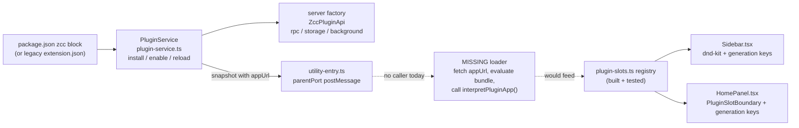

# Plugin System: Reaching the In-Process Model — Detailed Plan

This expands [`runtime-migration-backlog.md`](./runtime-migration-backlog.md)
Section 5 ("Plugin and Integration Services"). That section commits to the
direction — plugins as full-trust, in-process, server-owned code using a
`definePluginApp` slot registry, replacing the
retired per-extension `utilityProcess` + `PermissionBroker` design described in
`docs/extensions.md` / `docs/extensions-authoring.md`. The product contract for
**self-development** (any thread can extend ZCC; a new verb teaches the next
agent) lives in [`self-development.md`](./self-development.md).

**Status (2026-08-26):** Phase 0 (the app-bundle loader) is done.
`apps/app/src/plugins/plugin-app-loader.ts` fetches running snapshots, evaluates
`appUrl`, and calls `interpretPluginApp`. `ui.requestInput` is wired when the
host supplies `requestPluginInteraction`. Stale “no caller / always throws”
claims in §2 below are historical. Remaining work is the closed loop in
`self-development.md`: `zcc.cli`, generated `plugin-commands`, runtime skill
injection for every provider, and official plugins.

Everything here is grounded in reading the current plugin surface directly —
`packages/plugin-sdk/src/app-contract.ts`, `apps/app/src/lib/plugin-slots.ts`,
`apps/app/src/lib/plugin-slot-resolvers.ts`, and the nav-sidebar/panel-tab/
composer components; and zana's `packages/plugin-sdk`, `apps/server/src/plugins/`,
and `src/renderer/plugins/` as they exist today. No section below describes
aspirational slot behavior without citing the file that implements it, and no
"current state" claim is made without citing the zana file it's read from.

## 1. Where we already are

More is built than Section 5's four bullets suggest. In order of the pipeline:

**Manifest & id (`packages/domain/src/plugin-manifest.ts`, `plugin-id.ts`).**
A plugin is a `package.json` with a `zcc` block (`pluginPackageJsonSchema`,
Zod, `.strict()`), parsed by `readPluginManifest()` into a `PluginManifest`
(`id`, `packageName`, `version`, `name`, `description`, `branding`,
`serverEntry`, `appEntry`, `skillsRootPaths`, `projectTab`, `engines`).
`derivePluginId()` turns an npm package name into a stable id
(`@zana/tasks` / `zcc-plugin-tasks` → `tasks`) and rejects the reserved
sentinel `BUILTIN_NAV_SENTINEL = '__builtin__'` (`BUILTIN_NAV_ROW_PLUGIN_ID
= "__builtin__"` in `PluginNavSidebarItems.tsx`) so host-owned chrome can
share a plugin row's ordering/hiding machinery without ever colliding with a
real plugin id.

**One-release legacy bridge (`packages/plugin-sdk/src/legacy-shim.ts`).**
`shimLegacyExtensionManifest()` projects an already-installed `extension.json`
dir into the new `package.json` `zcc` shape, and
`plugin-service.ts#loadManifestFromDir()` tries `package.json` first, falling
back to `extension.json` through the shim. `migrateLegacySidecars()` (same
file) walks `~/.zcc/extensions/<id>/`, reads its `enabled.json` / `local.json`,
and installs each one through the normal `installParsed()` path once at boot.
This is the retirement mechanism for the old extension system — no separate
"dual system" period is needed; old installs become new-model installs the
first time the server starts.

**Server-side plugin lifecycle (`apps/server/src/plugins/plugin-service.ts`).**
`createPluginService()` is materially complete: `install()` handles all four
source kinds (`path:` / `git:` / `npm:` / `builtin:`) plus `catalog:` (resolved
against a marketplace index), `npm install --ignore-scripts` for npm sources,
`containsNativeAddon()` rejection, `engines.zcc` / `engines.zccPluginSdk`
range gating (`assertEngines`, using `satisfiesRange`/`compareVersions`
inspired by `checkApiCompat`/`compareVersions`), and a
status machine (`disabled` / `degraded` / `running`) persisted through
`plugin-store.ts`. `enable`/`disable`/`reload`/`remove` all route through
`loadOne`/`disposeOne`, which import the plugin's `serverEntry` via
`importServerFactory` + `runFactoryTimeBoxed`, handing it a `ZccPluginApi`
built by `createPluginApi()` (`plugin-api.ts`). A crashing or slow factory
degrades that one plugin (`status: 'degraded'`, `statusDetail`); it does not
take down the server.

**Server-side plugin API (`packages/plugin-sdk/src/server.ts`).** `ZccPluginApi`
already has the shape the in-process server-side plugin surface needs:
`log`, `settings` (typed descriptors + `PluginSettingsHandle`), `storage.kv`,
`rpc.method`, `realtime.publish`, `background.service`/`schedule`,
`agents.contributeInstructions`/`contributeSkills`, `ui.requestInput`,
`status.needsConfiguration`, `onDispose`. `plugin-api.ts#createPluginApi`
implements all of it except one member — see §2.

**Renderer slot registry (`src/renderer/plugins/plugin-slots.ts`).** This file
is the client-side plugin slot registry (see the file's own header comment):
registrations are replaced wholesale per plugin id via `replacePluginSlots`
(never appended — a reload cannot duplicate a row), `generation` increments
per reinterpretation (`bump()`), and `arrangePluginNavPanels()` is a direct
port of `arrangePluginNavPanels` from `pluginNavSidebarOrder.ts` — same
"never-ordered panels append in registry order" and "a stored key for a panel
that's not currently registered keeps its slot" invariants, same reasoning
(a slow-loading plugin's absence must not be read as removal).

**Renderer consumers already wired to it, with real crash isolation and
drag-reorder:**
- `src/renderer/components/Sidebar.tsx` imports `listSidebarFooterActions`/
  `subscribePluginSlots`, uses `@dnd-kit/core` + `@dnd-kit/sortable` +
  `@dnd-kit/utilities` (`DndContext` at line 462) for reordering, and keys
  rendered actions `${action.id}:${action.generation}` (line 520) — the
  generation-in-React-key remount pattern.
- `src/renderer/components/HomePanel.tsx` imports `listHomepageSections`/
  `subscribePluginSlots` and `PluginSlotBoundary`
  (`src/renderer/plugins/PluginSlotBoundary.tsx`) — a real per-slot error
  boundary keyed by `pluginId`+`generation`
  (`getDerivedStateFromError`/`componentDidCatch`, isolated render fallback),
  mounted at `key={`${section.id}:${section.generation}`}` (line 204) with
  `generation={section.generation}` passed through (line 206). This is the
  crash-containment model ("a throwing component degrades to that one card
  disappearing, never a page crash") **already implemented correctly** for
  the homepage slot.

**V1 slot contract (`packages/plugin-sdk/src/app-contract.ts`).** `navPanel`,
`settingsSection`, `homepageSection`, `projectTab`, `sidebarFooterAction` —
each a typed registration function on `PluginAppSlots`, collected by
`collectPluginApp()` into a `PluginRegistrationSet`, unit-tested in `app.test.ts`.

So: manifest → install → server factory → RPC, and registry → sidebar/homepage
rendering, are both real, tested, and follow the in-process slot patterns
where an equivalent exists. The system is not "not started" — it has no
working end-to-end path yet, for one specific reason.

## 2. The one broken link (fix first, before adding any new slot)

`plugin-service.ts#snapshot()` already returns everything a loader would need
per installed plugin — `appEntry`, and `appUrl` computed as
`/plugins/${row.id}/assets/${row.appEntry.split(/[/\\]/).pop()}` (line 421).
That snapshot is asked for exactly once in the codebase today —
`apps/server/src/utility-entry.ts:189`, inside the worker's `parentPort`
message handler, answering a `plugins?.snapshot()` request from whoever's on
the other end of that channel.

Nothing on the other end exists yet. `interpretPluginApp()`
(`src/renderer/plugins/plugin-slots.ts:50`) — the function that takes a
plugin's evaluated bundle export and turns it into a `PluginRegistrationSet`
via `collectPluginApp` — is referenced **only by its own definition and its
own unit test** (`plugin-slots.test.ts`). No renderer code calls it with a
real bundle. There is no code anywhere in `src/renderer` that requests the
snapshot from main/desktop, fetches `appUrl`, evaluates the module, and feeds
its default export to `interpretPluginApp`. `Sidebar.tsx` and `HomePanel.tsx`
are fully wired to *consume* the registry — there is simply nothing that ever
*populates* it for a real installed plugin. Compare `ui.requestInput`
(`apps/server/src/plugins/plugin-api.ts:81-82`), which is not a stub loader
gap but a stub implementation: `async () => { throw new Error('ui.requestInput
is not available in this runtime'); }` — always throws, regardless of caller.

**This is Phase 0, and it blocks every slot below**, existing and proposed —
none of them render anything in a real running app until a plugin's renderer
bundle actually reaches `interpretPluginApp`.

### Phase 0 tasks

1. **Desktop/main → renderer transport for the snapshot.** Something needs to
   ask the server utility process for `plugins.snapshot()` (reusing the
   existing `parentPort` request that `utility-entry.ts:189` already answers)
   and forward it to the renderer — most naturally through whatever IPC
   channel already carries other server-owned state to the renderer (check
   `src/main/index.ts`'s existing IPC registration pattern before adding a new
   channel shape). Also forward it again on `plugin-slots-changed` (install/
   enable/disable/reload) — the renderer needs to reload a plugin's bundle
   when its status flips to `running`, not just once at boot.
2. **Renderer loader.** A new module, e.g.
   `src/renderer/plugins/plugin-loader.ts`, that: for each snapshot row with
   `status === 'running'` and a non-null `appUrl`, fetches the bundle (same
   blob-import approach the retired extension-sdk used — see
   `docs/extensions.md`'s "blob-imported ESM bundles" line — or a plain
   `import(appUrl)` if same-origin dynamic import is viable under the new
   server-hosted-static-assets model per Runtime Foundation #2), reads its
   default export, and calls `interpretPluginApp(row.id, defaultExport)`. On
   `disabled`/`degraded`/removal, call `clearPluginSlots(row.id)`.
3. **React injection, if still needed.** The in-process model does not have
   plugins bundle React — they receive the host's instance through
   `activate({ React, host })` (`packages/plugin-sdk/src/app-contract.ts`; see
   `definePluginApp`). Zana's new `definePluginApp` setup function
   takes only `app` (`PluginAppSetup = (app: PluginAppBuilder) => void`), no
   React argument — so a plugin's `component: ComponentType<...>` fields are
   plain values calling `React.createElement`/JSX like any other module.
   Decide now, before wiring the loader: does a zana plugin bundle its own
   React (simplest — no shim needed, at the cost of two React copies if a
   plugin also imports a component library that hooks into the host's React
   context, e.g. a shared theme provider), or does it need the same
   `globalThis.__ZCC_HOST_REACT__` shim the retired extension-sdk used for
   JSX/hooks/lucide-react (`docs/extensions-authoring.md`
   "Using JSX, hooks, or a UI library")? Given plugin panels now render
   through ordinary component composition (`PluginSlotBoundary` wraps a
   `ComponentType`, not a blob-imported subtree with its own mount call), a
   bundled React is the simpler default — flag it explicitly in the plugin
   authoring guide once this doc's Phase 0 ships, rather than silently
   inheriting the old shim requirement.
4. **Tests.** `plugin-loader.test.ts` covering: a running plugin's snapshot
   populates the registry; a degraded/disabled plugin does not; a
   status-flip event reloads or clears the registry entry; a bundle that
   throws on evaluation degrades gracefully (does not crash the shell) —
   mirroring `resetCrashedPluginSlots` intent even though the actual
   error-boundary work (`PluginSlotBoundary`) is already done downstream.

## 3. Slot-by-slot: target model vs. zana's V1 vs. proposed

| Target mechanism (source) | zana today | Gap | Proposal |
|---|---|---|---|
| `navPanel` (`app-contract.ts`; ordering/hiding in `pluginNavSidebarOrder.ts`) | `navPanel` slot exists (`app-contract.ts`); `arrangePluginNavPanels` ported verbatim into `plugin-slots.ts`; drag-reorder wired in `Sidebar.tsx` | Loader gap only (§2) — the mechanism itself is done | No new work beyond Phase 0 |
| `sidebarFooterAction` | Exists, wired in `Sidebar.tsx` with generation keys | Loader gap only | No new work beyond Phase 0 |
| `homepageSection` | Exists, wired in `HomePanel.tsx` with `PluginSlotBoundary` | Loader gap only | No new work beyond Phase 0 |
| `settingsSection` | Slot exists in `app-contract.ts`/`plugin-slots.ts` (`listSettingsSections`) | **No renderer consumer yet** — grep found no `listSettingsSections` import outside `plugin-slots.ts` itself | Add a settings-panel mount point (likely in `src/renderer/components/settings/ExtensionsHub.tsx`, which the current uncommitted diff already touches) that renders each registered `PluginSettingsSectionRegistration.component` inside its own `PluginSlotBoundary`, keyed by generation — same pattern as `HomePanel.tsx`, not a new pattern |
| `experimental_threadList` (exclusive list-replacement slot; `app-contract.ts`) | No equivalent | N/A today | **Defer.** This slot exists in chat-client shells built around one scrollable thread list. Zana's closest analogue would be replacing the project list (`ListPane.tsx`/`ProjectsList.tsx`) — a much higher-blast-radius slot than anything else here. Do not build it speculatively; revisit only if a concrete plugin needs to replace the project list wholesale |
| `threadPanelAction` / `experimental_newThreadPanelAction` + the `FixedPanelTab` union + `thread_tabs` JSON-blob-plus-revision persistence (`fixed-panel-tabs-state.ts`, `packages/db/src/schema.ts`) | `projectTab` exists — but it is **one static tab per plugin**, declared in the manifest, not a runtime "open an ad-hoc tab" call. There is no tab-strip union a plugin can insert into dynamically, and no persistence table for it | Real gap — the richest UI mechanism in the target set has no zana counterpart yet | **Proposed `projectPanelAction` slot** (naming intentionally distinct from `projectTab` to avoid confusion): `{ id, title, icon?, component, run?() }`, resolved the same way `threadPanelAction` is resolved — calling `run()` (or, if absent, opening with defaults) inserts an entry into a new per-project tab-strip state analogous to the `FixedPanelTab` union. Given zana's existing per-project tabs (Terminals · Explorer · Preview · Library · Tickets, per `docs/extensions-authoring.md`'s `projectTab` section) are apparently already a **fixed, enumerable set** rather than a dynamic strip, the first implementation step is establishing that the tab strip *can* hold a dynamic, session-scoped list at all — a strictly smaller version of a `threadTabs` table (one JSON blob + revision, scoped by project id instead of thread id) is the right persistence shape once that exists. **Sequence this after Phase 0 and after `settingsSection` — it is a UI architecture change, not just a new slot type** |
| `fileOpener` (`app-contract.ts`) | No equivalent | Real gap, but low priority | Zana's `Explorer` project tab is a candidate host, but wiring "which viewer wins for a given extension" needs the tab-strip work above to land first, so a plugin-registered opener has somewhere to open into |
| `experimental_threadHeaderAction` / `messageAction` / `messageDirective` / `experimental_providerIcon` (all chat-transcript-scoped) | No equivalent, and **arguably no analogue** | N/A — zana has no per-message chat transcript UI; it is a terminal/session hub, not a chat client | **Do not port.** These slots exist because a chat client renders an agent conversation as a message list. Zana's nearest surface is a terminal pane (raw PTY output) or a session's status row — neither is "per message." Revisit only if zana grows a structured per-turn transcript view (e.g. a persona chat panel) that these would genuinely extend |
| `pendingInteraction` (backend-triggered, scoped to one interaction, `submit`/`cancel`) | **Server API promises it** (`ZccPluginApi.ui.requestInput`) but **the implementation always throws** (`plugin-api.ts:81-82`) | Real, concrete, already-half-committed gap — the contract exists, the renderer half doesn't | Add a `pendingInteraction` V2 slot: `{ id, component: ComponentType<{ payload, submit, cancel }> }`. Server-side, `requestInput(rendererId, payload)` needs a real channel to the renderer (piggybacking on whatever transport Phase 0 builds for snapshots/events) that (a) delivers `{ rendererId, pluginId, payload }` to a renderer-side pending-interaction store, (b) mounts the matching registered component, and (c) round-trips `submit(value)`/`cancel()` back to resolve/reject the original `requestInput` promise. This is the exact model — server-triggered, not always-mounted |
| `composer.customize()` (actions/banners/plusMenu/richText on the shared prompt composer) | No equivalent | N/A — no shared "composer" surface exists in zana today | **Do not port speculatively.** If zana's `AgentLauncher.tsx` prompt box grows plugin-extensibility needs (e.g. a plugin wanting to add a banner above the launch form), design a zana-specific customization surface against that concrete component then — don't pre-build a four-contribution-kind abstraction against a surface that doesn't need it yet |
| `contentScripts.register()` (headless same-origin script, `AbortSignal`-scoped) | No equivalent | Low priority | Covered implicitly by `background.service()` already on `ZccPluginApi` (server-side) — a renderer-side headless-script slot would only be worth adding if a plugin needs renderer-only background work with no visible UI at all, which `background: () => void` in `ActivateResult`-equivalent (the retired extension-sdk had this) did not carry over into the V1 slot set. Track as a candidate, not a commitment |
| `agentPreset`, `skills`/`mcpServers` contribution, `ssh:hosts` provider, Personas/Teams contribution (retired extension-sdk, `docs/extensions-authoring.md`) | **Not yet re-ported** to the new plugin-sdk manifest/`ZccPluginApi` at all | Real gap — these are zana-specific capabilities the generic slot set has no equivalent for, but they are real, documented, working features today on the old system that `migrateLegacySidecars` will otherwise silently drop | **This is the actual risk in the retirement, not the slot-parity gaps above.** Before removing the old extension-sdk (backlog Section 5's stated goal), each of `agentPreset`, `skills`/`mcpServers`, `ssh:hosts`, and Personas/Teams needs either a `ZccPluginApi`/`PluginAppSlots` equivalent or an explicit decision that it's out of scope for V1 plugins. `ctx.personas`/`ctx.teams` (in-memory, lifecycle-bound, host-namespaced `ext:<id>:<slug>`) maps cleanly onto `ZccPluginApi` — add `personas`/`teams` members mirroring the retired `MainModuleContext` shape. `agentPreset`/`skills`/`mcpServers` are manifest-declared today (not runtime-registered) — the natural home is `PluginManifest`/`pluginZccManifestSchema` (`packages/domain/src/plugin-manifest.ts`), which does not yet have fields for any of them |

## 4. Phased plan

Ordered so each phase's completion gate is checkable independently, matching
the granularity of the existing backlog's other sections.

**Phase 0 — Close the loader gap (§2).** Nothing else matters until a real
installed plugin's `navPanel`/`homepageSection`/`sidebarFooterAction` renders
in a running app. Completion gate: installing `tools/create-zcc-extension`'s
`sample-hello`-equivalent through the new `PluginService` (once it's ported to
the `zcc` manifest shape) produces a visible sidebar row end-to-end, no manual
registry population in a test.

**Phase 1 — `settingsSection` renderer consumer.** Smallest possible next
step: the slot and registry side already exist; only the mount point is
missing. Completion gate: a plugin's `settingsSection` renders inside
`ExtensionsHub.tsx` (or wherever the settled location is once the in-flight
`ExtensionsHub.tsx` diff lands), crash-isolated the same way `HomePanel.tsx`
isolates `homepageSection`.

**Phase 2 — `pendingInteraction`.** The contract half-exists
(`ZccPluginApi.ui.requestInput`) and is a stub that always throws — this is
the most "already-promised, not-yet-real" gap, and unlike the tab-strip work
it does not require a UI architecture change first, only a transport +
renderer mount. Completion gate: a plugin's `ui.requestInput(rendererId,
payload)` call actually suspends until a rendered `pendingInteraction`
component calls `submit`/`cancel`.

**Phase 3 — Retirement-blocking gaps (Personas/Teams, `agentPreset`,
`skills`/`mcpServers`, `ssh:hosts`).** Do this **before** deleting the old
extension-sdk runtime, not after — `migrateLegacySidecars` only moves the
*plugin*, not any of these contributions, into the new system. Completion
gate: every bundled first-party plugin in `plugins/` that uses
one of these (check each one's `extension.json` for `agentPreset`/`skills`/
`mcpServers`/`ssh:hosts` before assuming none do) has a working equivalent on
the new system.

**Phase 4 — Dynamic per-project tab strip + `projectPanelAction` + `fileOpener`.**
The biggest single piece of net-new UI architecture in this plan. Sequence it
last among the items above because it is the one gap that is a genuine
product decision (does zana want plugin-openable ad-hoc tabs at all,
independent of slot-parity) rather than a mechanical port. Completion gate:
a plugin can open a tab into a project's workspace at runtime (not just
declare one static `projectTab`), and that tab's presence survives a reload
via a persisted per-project tab-state record.

## 5. Deliberately not doing (and why)

- **No permission broker for V1 plugins.** Already decided in
  `runtime-migration-backlog.md`'s Non-Negotiable Invariants: "Plugins are
  full-trust... Install uses path containment, `engines` gates,
  `npm --ignore-scripts`, and native-addon rejection — not capability tokens
  or a permission broker." This plan does not revisit that; every slot
  proposal above assumes full trust, which is also the in-process model's
  own model (no permission broker either; the trust boundary is the
  host-daemon/server split, which zana's plugins sit entirely inside, on the
  server side of).
- **No renderer-side process isolation.** Plugin UI shares one page/React
  tree with curated trust, error-boundary-isolated only (the
  "Honest residual" section of zana's own retired `extensions-authoring.md`
  says the same about the old system: "all panels currently share one
  `window.cc`... Treat the platform as curated-trust for panels"). The new
  model doesn't change this, and this plan doesn't propose changing it —
  `PluginSlotBoundary` is the only isolation.
- **No message-level extensibility** (`messageAction`/`messageDirective`/
  `experimental_threadHeaderAction`/`experimental_providerIcon`) — no product
  surface in zana to extend (§3 table, row 6).
- **No composer customization** — no shared composer surface exists yet to
  customize (§3 table, row 7).

## 6. Where this leaves Section 5 of the backlog

Item 1 ("Server-owned `PluginService`...") is **substantially done** —
`apps/server/src/plugins/plugin-service.ts` covers install sources,
provenance, in-process `loadOne`/`disposeOne`, builtin registry, and
status/degraded; asset serving at `/plugins/:id/assets/` is implied by
`snapshot()`'s `appUrl` computation but not verified here as an actual served
route (check `apps/server`'s route table before marking this sub-item done).
Item 2 ("Renderer slot registry...") is **also substantially done** on the
registry side (`plugin-slots.ts`, `PluginSlotBoundary`, `Sidebar.tsx`,
`HomePanel.tsx`) but has **zero real plugins flowing through it** (§2) — the
backlog's phrasing ("wholesale replace per plugin id, generation remount,
per-slot error boundaries") describes work that is done; it does not mention
that nothing calls it yet. Item 3 ("Marketplace is discovery + provenance
only") matches `marketplace-store.ts`/`addMarketplace` as read. Item 4 has not
been investigated in this pass.
