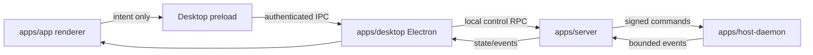

# Runtime Migration Backlog

## Goal

Replace the legacy Electron-main product runtime with a local server-authoritative
architecture while preserving ZCC's sandboxed renderer, preload bridge, path
confinement, extension isolation, and existing user data.

The target runtime is:

## Non-Negotiable Invariants

- Renderer input is untrusted. Desktop and server independently authorize each
  action before access, execution, or durable state changes.
- Only the server owns product durable state once a capability is migrated.
- Host executes only server-issued, authenticated, unexpired commands. It does
  not resolve arbitrary paths, projects, binaries, or grants.
- Electron owns OS integration only: windows, preload, permissions, native menu,
  updater, tray, notifications, and child supervision.
- Disk extensions remain utility-process isolated and retain brokered capability
  enforcement. No extension gets raw server or host credentials.
- Every migration task has a compatibility adapter, focused tests, and an
  end-to-end proof before the former main-process owner is removed.
- Every wire message declares its protocol version. A version mismatch fails
  before dispatch; changing a field's shape or meaning requires a version bump
  unless compatibility with the previously shipped endpoint is implemented and
  tested deliberately.
- Server restart or desktop reconnect can lose only bounded convenience caches.
  Accepted product state and terminal event history are durable and replayable
  from a server-owned cursor, never reconstructed from Electron memory.

## Ordered Work

### 1. Runtime Foundation

1. Harden utility-process lifecycle, request correlation, deadlines, crash
   propagation, and shutdown acknowledgement.
2. Make the server utility process the only renderer static host in packaged
   runtime, retaining file loading only for startup repair.
3. Make the host utility process the only consumer of signed execution commands.
4. Add a server control protocol for capability requests, responses, and
   subscriptions; never expose the host control credential to the renderer.

Completion gate: server/host children restart or fail closed; Electron smoke
proves loopback UI origin and preload round-trip; no orphan children remain on
quit.

Current progress (as of 2026-08-19; authored by a concurrent session, not
verified end-to-end — see the regression note below before building on it):
`src/main/runtime-supervisor.ts` (`startRuntimeSupervisor`) now forks two
Electron `utilityProcess` children from `electron.vite.config.ts`'s new
`server-runtime`/`host-runtime` build entries
(`apps/server/src/utility-entry.ts`, `apps/host-daemon/src/utility-entry.ts`):
the server child owns `startStaticHost` (serves renderer assets over loopback,
Runtime Foundation #2) plus `readProjectSnapshot`/`createTerminalExecutionService`;
the host child owns `startHostDaemon`. Correlation-id request/response and a
`stop`/`stopped` shutdown handshake are implemented in `createUtilityRuntime`.
`src/main/index.ts`'s `ensureRendererStaticHost()` calls this at
`bootstrapNormal()` time (skipped when `ELECTRON_RENDERER_URL` is set, i.e. dev
mode) and `createWindow()` now loads from `rendererUrl()` (falling back to
`loadFile` only for the repair-only window, per Runtime Foundation #2's
completion gate).

**Regression fixed (2026-08-19)**: the packaged Electron E2E suite is back to
22/22. Root cause of `e2e/startup-repair.spec.ts`: once a repair retry
succeeds, `productionOrigin` becomes set and `isTrustedRendererUrl`
(`renderer-url.ts`) starts judging the still-open `file://` repair document
against the new loopback origin — so the renderer's own
`window.location.reload()` and main's `will-navigate` guard raced. Whichever
navigation the guard saw second got `preventDefault()`'d, and a prevented
navigation superseding an in-flight one left BOTH cancelled (no `did-fail-load`,
no `framenavigated`, nothing observable — confirmed by sanity-checking that
`loadURL()` to a deliberately bad URL on the same live window DID produce the
full failure sequence, isolating the issue to the double-navigation race, not
`loadURL` itself). Fix: `runStartupMigration()` in `src/main/index.ts` now
unconditionally drives this navigation itself (`win.loadURL(url)`, Rule 1 —
renderer is untrusted, main authorizes) and `StartupRepair.tsx`'s `retry()` no
longer calls `window.location.reload()` — main is the only side that ever
navigates this window, in both prod (loopback swap) and dev (same-origin
reload), so there is no second navigation to race. `e2e/harness-routing-settings.spec.ts`
and `e2e/agent-launch-ui.spec.ts` were unrelated to the runtime migration: an
upstream "standardize picker controls" change (mirroring
`zana-command-center`'s `feat(ui): standardize picker controls`) replaced the
harness-routing and target-project native `<select>`s with `PopoverPicklist`
(trigger button + portal-rendered `role="listbox"`/`role="option"`), and the two
specs were still driving them via `selectOption`. Updated both specs to open
the trigger and click the matching `role="option"` by label (noting the
reset-to-default option label differs by scope: "Use harness default" in
Global Code Harness settings vs. "Use global default" in Project settings).
All three specs verified green twice in a row; full suite (22/22), `pnpm run
build`, `pnpm run typecheck`, and the serial Vitest suite (4603/4604 passing —
the one failure, `local-extension-hot-reload.integration.test.ts`, is the
known `fs.watch`-tmp-dir race documented as flaky-under-full-suite; it passes
in isolation) all pass as of this session. **Multi-agent note**: this worktree
(`runtime-server-host-migration`) may have concurrent peer sessions
(handle `config-store-extraction`, and a second unnamed "Complete server-host
runtime migration" session) editing this same uncommitted working tree at
once — coordinate before editing `runtime-supervisor.ts`/`config-store.ts`/
`renderer-url.ts`/`index.ts`'s `runStartupMigration`/`StartupRepair.tsx` again,
or changes will race. Runtime Foundation #1/#2 are now unblocked on the E2E
front; #3/#4 (host as sole consumer of signed execution commands; server
control protocol) remain unaddressed — see Execution Foundation's progress
notes below for the closest existing work.

### 2. Durable Foundation

1. Extract a server-owned persistence adapter with atomic serialized writes.
2. Introduce a server-owned database/schema/migration boundary before adding
   more independent JSON stores. Preserve existing JSON files only as an
   idempotent import/export compatibility format during the transition.
3. Model state by its read and consistency requirements: normalized records for
   projects, host-scoped locations, sessions, and pending work; revisioned
   blobs only for truly transient layout/preferences; append-only tables for
   audit/replay history.
4. Migrate app configuration reads and project reads to it.
5. Route renderer IPC reads through desktop-to-server RPC.
6. Migrate configuration and project mutations, including path confinement and
   change subscriptions.
7. Migrate local extension metadata and project-category metadata.

Completion gate: server owns reads, writes, and emitted snapshots for projects
and config; Electron main no longer imports their storage implementation except
for temporary startup migration.

Current progress: `projects:list` is now served by the server utility process
from the on-disk project snapshot. The server-owned atomic/serialized durable
persistence primitive (Durable Foundation #1) now exists at
`apps/server/src/durable-store.ts` — a byte-for-byte port of
`src/main/harness-routing-migration/storage.ts` (same temp+fsync+rename+dirsync
sequence, same CAS-by-hash semantics, an independent `createSerializedTransactionQueue`
per store) — with its own focused tests
(`apps/server/src/durable-store.test.ts`). It has no consumer yet: project and
config mutations still write through the legacy `src/main/store.ts` path. The
next bounded step is a server-owned project mutation (add/update) built on this
primitive with the same path-confinement/dedup rules as `store.addProject`,
proven by focused tests before any IPC route changes. Configuration reads
remain on the compatibility path: `normalizeConfig` and
`projectConfigCompatibility` in `src/main/store.ts` depend on
`registeredAdapters()` (the harness registry, populated at Electron boot for
5 harness families) — porting config reads requires moving that normalizer and
harness projection together, per the existing inline comment at the
`IPC.config.get` handler; do not port a raw JSON config reader ahead of it.

Update (2026-08-19, from a concurrent session — see the Runtime Foundation
multi-agent note above): `src/main/config-store.ts` (`createConfigStore`) now
exists as a first step on that path — it is an Electron-free extraction of
`store.getConfig`/`setConfig`'s exact behavior (same fallback defaults, same
`normalizeConfig`/`projectConfigCompatibility`/`canonicalConfigForWrite`/
`harnessEnabled` injection points) but writes through `atomicDurableWrite`
(CAS-by-hash) instead of the old unconditional `writeJson`. `store.ts` now
delegates `getConfig`/`setConfig` to it directly — this is still an in-process
extraction (no IPC/server boundary crossed yet; `registeredAdapters()` is
still called from Electron's own harness registry), so it does not yet satisfy
"Route renderer IPC reads through desktop-to-server RPC" (#3) on its own. It
has no dedicated focused test file yet. (The `harness-routing-settings.spec.ts`
E2E regression this note used to flag as a plausible contributor turned out to
be the `PopoverPicklist` selector-migration issue documented in the Runtime
Foundation regression note above — unrelated to this extraction.)

Update (2026-08-19): Durable Foundation #4's first end-to-end vertical slice
now routes local `projects:list`, `projects:add`, and the simple
name/color form of `projects:update` through the server utility process. The
strict desktop-to-server control protocol is in
`packages/contracts/src/runtime.ts`; `apps/server/src/utility-entry.ts` owns
one `createProjectStore` instance for all three operations (the former
read-only `project-reader` compatibility path is deleted); and
`src/main/runtime-supervisor.ts` exposes its typed adapter. A packaged runtime
does not fall back to `store.addProject` after a server failure because a timed
out request may already have committed. The compatibility path remains only
when no runtime supervisor is active, and for fields not yet migrated
(`defaultAgents`, personas, launch defaults, favorite, and remote path).

`apps/server/src/project-store.ts` persists only canonical absolute local
paths: it `realpath`s an existing directory before deduplicating and writing,
so relative paths and symlink aliases cannot become separate durable project
trust anchors. Its strict contract permits only the bounded name/color/category
patch; names reject controls and invalid colors are ignored. The store queues
read-modify-write transactions and CAS-guards them against an external legacy
writer, preserving the existing `{version: 1, projects: [...]}` envelope and
legacy bare-array reads. It deliberately does not yet own remote project
creation, removal, ordering, touch/backfill, scratch/Quick Agent behavior, or
project settings.

Electron main still owns all post-mutation native integration: MCP config
creation, feed records, store rebinding, watcher updates, and renderer push
compatibility. `IPC.projects.onChanged` now publishes the server snapshot after
a successful server-authoritative local add/update, eliminating the previous
cross-window staleness for these two paths. The host utility process now also
sends the `stopped` acknowledgement required by the supervisor shutdown
protocol.

Update (2026-08-19): the app-managed `project-settings.json` mutation path now
has a server-owned `ProjectSettingsStore`, serialized and CAS-guarded with the
same durable writer as projects. `project-settings-get`, `project-settings-set`,
and `project-settings-remove` are bounded runtime operations. Packaged renderer
IPC reads/writes and project-removal cleanup route through the server; reads stay
best-effort while writes deliberately reject so optimistic UI state can roll
back. The server projects canonical harness compatibility fields back to the
legacy launch-facing view and persists writes in the canonical containers.

Update (2026-08-19): production launch preflight and commit-time revalidation
now read settings through the runtime supervisor, so an interactive launch and
background scheduler/goal launch consume the same server-owned snapshot that
accepted the write. Background managers no longer attach settings from the
legacy store; `launchBackgroundTerminal` fetches and snapshots them before
authorization, then passes the authorized snapshot to spawn. The synchronous
legacy fallback remains only when no runtime supervisor is active, including
development and isolated low-level spawn tests. Do not delete
`store.getProjectSettings` until those compatibility paths are retired.

Following the reference architecture's post-commit invalidation discipline, a
successful server settings write now emits a typed, project-scoped
`project-settings-changed` event. Desktop forwards the invalidation through the
preload bridge, and mounted project settings views refetch the authoritative
projection unless they have an in-flight local save. The event carries no
settings payload, so the renderer never becomes a second source of truth.

Update (2026-08-19): packaged `projects:remove` now deletes the project record
and its app-managed settings through one server runtime request. The server also
performs best-effort cleanup of an exact remote placeholder path only when it is
the app-owned `<dataDir>/remote-projects/<projectId>` directory. Desktop keeps
the remaining native fan-out (closing PTYs, schedule/goal/follow-up/feed
rebinding, watcher teardown) after the authoritative removal succeeds.

**Reference-alignment prerequisite (2026-08-19)**: the current project and
project-settings stores correctly provide atomic, serialized, CAS-guarded JSON
writes, but they remain separate JSON files. Before migrating the broader
Product Services set, introduce one server-owned database/schema and migration
boundary. The database must become the only durable source of truth; the
existing JSON envelopes become a startup import/export compatibility path, not
the permanent product model. This is intentionally ahead of broad service
migration: independent JSON stores cannot provide transactional relationships,
query-specific indexes, or a durable event log as sessions/schedules/inbox
state arrive.

Remaining project slices: migrate remote creation/update, Quick Agent/clone/
extension registration, and then replace Electron-main project readers in
authorization consumers with a server snapshot subscription. Do not remove
`store` project compatibility methods until each dependent consumer is migrated
and packaged Electron E2E proves the new authority path.

Update (2026-08-19): clone execution remains desktop-owned for its bounded git
process, destination lock, and filesystem cleanup semantics, but the completed
clone's local-project registration now uses the existing server `projects-add`
operation in packaged mode. The shared helper covers both UI and MCP clone
entry points, preserves native post-registration rebinds, and never falls back
to the legacy writer after a server failure because a timed-out response may
already have committed. The agent-facing `register_project` tool follows the
same rule after desktop confines its supplied path to HOME, the clone root, or
an existing project. Remote creation, Quick Agent/scratch migration, and
extension-project registration remain distinct slices.

Update (2026-08-19): local extension project registration now also uses server
`projects-add` in packaged mode, followed by the bounded name/category update
needed to preserve the local-source self-healing contract. The source
`extension.json` remains a best-effort classification hint; the main-owned
local record explicitly establishes the `Ext: <title>` label. Quick Agent/scratch
and remote project records still require dedicated server contracts.

### 3. Execution Foundation

**Execution modes are deliberately separate.** This migration lane covers the
current direct PTY product: a `plain-terminal` is a shell or command in a host
PTY, and a `terminal-agent` is an authorized coding-agent CLI in that same
visible PTY. Both retain direct terminal input, resize, output, scrollback, and
exit behavior. An agent may later associate with a logical product record, but
the raw ANSI stream remains terminal transport data rather than a structured
agent event log.

**Managed harness work is deferred.** Provider bridges, structured threads,
native provider session identity, transcripts, approvals, and BB-style harness
events require their own server-owned contracts and parity coverage. Do not add
those semantics as optional fields to the direct terminal protocol or make the
host infer provider policy. A future `managed-harness` mode will be introduced
as a separate capability after the direct PTY authority boundary is stable.

Every host connection has three identities: a stable `hostId` for the durable
host installation, a fresh `instanceId` for one daemon lifetime, and a
server-issued `hostConnectionId` lease bound to that host instance. Signed
terminal commands and every host event carry this binding. The server rejects
events from expired, replaced, or different host instances before they mutate a
session or its replay cache. A restarted daemon is a new host epoch, not proof
that prior PTY handles survive; recovery remains an explicit server decision.
The server renews the active lease before its bounded expiry and the host applies
the same expiry locally. A new lease for a host finalizes terminal rows owned by
the superseded lease as unavailable rather than allowing stale PTY state to look
running; a later reconciliation capability must explicitly prove reattachment.

1. Specify session launch, input, resize, close, restore, output, and exit
   contracts.
2. Implement host session lifecycle with bounded stream retention and sequence
   IDs.
3. Persist accepted terminal session records and append-only events in the
   server database. The server assigns the durable per-session sequence inside
   the accepting transaction; host-provided stream offsets are transport hints,
   never the authoritative replay cursor.
4. Define host identity separately from an authenticated host-connection
   session, then define reconnect/re-dispatch semantics for live PTYs. A host
   restart may lose only its process handles and bounded local scrollback; a
   server restart must recover accepted session state and replay history.
5. Move launch planning and authorization to server, preserving exact argv
   precedence and project/path checks.
6. Route terminal IPC through server, then remove legacy PTY ownership from
   Electron main.
7. Migrate local/remote/tmux recovery and restore capabilities.

Reference alignment: the target design follows the clean split proven in the
reference workspace: server owns accepted session identity, state, and event
sequencing; host owns only PTY handles plus bounded scrollback; desktop remains
the native-shell and compatibility adapter, never the durable terminal owner.
The existing signed terminal-command seam is retained because it is stricter
than a transport-only daemon session. The next terminal slice is intentionally
the host replay/attach boundary, not a premature rewrite of remote SSH or tmux:
the runtime-host adapter requests the host's bounded backlog before handing
output to late listeners, de-duplicates by sequence, and caps its own
pre-attachment buffer. This gives the current local-shell lane the required
replay-before-live behavior while server session records and other terminal
modes migrate separately.

The local non-tmux lane is now profile-agnostic behind the internal
`ZCC_RUNTIME_HOST=1` gate: the existing main-side launch planner still produces
the exact authorized argv/env, but Claude, Codex, OpenCode, Cursor, Pi, and
shell can hand their final local PTY command to the signed host boundary. This
does not include remote SSH, local tmux, sandbox, or microVM, which retain their
specialized compatibility paths until their recovery/isolation semantics have
dedicated host contracts and parity coverage.

Update (2026-08-19): the runtime-host lane's late attachment replay now comes
from the server's accepted terminal-event history rather than requesting host
scrollback directly. The server records only events it accepted for the current
session epoch and exposes a bounded `terminal-events-since` control operation;
desktop still deduplicates by sequence while its live host subscription remains
active. This advances server session authority without changing the host's
bounded raw-scrollback retention or any remote/tmux/isolation path.

Update (2026-08-19): both process boundaries now have strict wire-version
gates. `SERVER_RUNTIME_PROTOCOL_VERSION` is required on every desktop-to-server
utility-process message, and `TERMINAL_HOST_PROTOCOL_VERSION` is required on
every signed terminal command and host event. The schemas reject mismatches
before dispatch, and the signed terminal version participates in canonical JSON
and therefore in the HMAC. Bump the respective version for any wire-shape or
meaning change unless an explicit compatibility path and test covers the
previous version. This is a compatibility prerequisite, not a claim that the
protocol is network-ready: the current transport remains local Electron utility
IPC plus loopback HTTP.

Update (2026-08-20): the loopback renderer host now exposes one deliberately
bounded browser surface, `GET /_zcc/bootstrap`. It is enabled only on a
loopback bind, requires same-origin requests when an Origin is supplied, and
returns only the app version plus redacted project summaries (no paths,
credentials, host identifiers, or mutation capability). `src/renderer/main.tsx`
detects a missing Electron preload and renders a browser-only local-status view
instead of polyfilling `window.cc`. This is an explicit safety boundary, not a
browser migration claim: terminal input/output, event streams, settings,
extensions, and every privileged action remain desktop-only until individually
designed as server-owned APIs.

**Reference-alignment ordering (2026-08-19)**: the current
`TerminalSessionService` is an in-memory acceptance/replay cache and accepts
host-assigned output sequence values. Do not extend terminal IPC ownership or
remote/tmux recovery on that foundation. First replace it with a server-backed
session/event repository that transactionally assigns the replay cursor and
persists accepted events, then add host identity/connection records and
reconnect behavior. This prevents a server restart from losing the only
accepted-event history or making replay cursor semantics ambiguous.

Update (2026-08-19): the first server database migration is now live for the
terminal lane. The server owns `runtime.sqlite`, records applied schema
migrations, and persists accepted `terminal_sessions` plus bounded
`terminal_events`; restart tests prove replay survives a new server repository
instance. The current persisted cursor deliberately mirrors the host stream
sequence for compatibility. A later terminal-contract version bump must add a
distinct server-minted durable cursor before claiming full reference alignment;
the database slice establishes the schema/migration boundary without changing
the live terminal protocol's semantics.

Completion gate: host owns every live terminal child; server owns every session
record and authorization decision; golden argv and terminal E2E suites pass.

Current progress: Steps 1 and 2 are implemented and independently tested.
`packages/contracts/src/terminal-execution.ts` specifies the full
start/write/resize/terminate/get-backlog command union and the
accepted/started/output/exited/rejected event union (Zod discriminated
unions), signed via `canonicalJson` (not the older `execution.ts` contract's
plain `JSON.stringify`, since signatures must not depend on key-insertion
order). `apps/host-daemon/src/terminal-manager.ts` (`HostTerminalManager`)
implements host-side session lifecycle: commandId-keyed idempotent dedup
(capped at 1000), epoch-checked session lookup, bounded backlog
(`MAX_BACKLOG_BYTES = 256 * 1024`) for `get-backlog` replay, and ordered
accepted→started→output*→exited emission — covered by
`terminal-manager.test.ts`. `apps/host-daemon/src/daemon.ts` now exposes an
authenticated `POST /terminals` route (token + HMAC-over-canonical-JSON
signature + deadline check, mirroring `/commands`'s security checks) that
takes an optional `terminalManager: HostTerminalManager` and delegates to
`terminalManager.handle(command)`, returning `501` if no manager is attached
— proven by `daemon.test.ts`. `apps/server/src/terminal-execution-service.ts`
(`createTerminalExecutionService`) is the server-side signer/caller that
POSTs signed commands to that route and parses the returned events —
proven by `terminal-execution-service.test.ts` against the real daemon
(aliased in `apps/server/vitest.config.ts`), not a mock. None of this is
wired to Electron yet: `src/main/pty.ts` still owns argv/env assembly and
spawns terminals directly, and no launch request has been routed through
`createTerminalExecutionService`. Steps 3 and 4 (move launch planning and
authorization to the server, then route terminal IPC through it and retire
Electron's own PTY ownership) are the next bounded steps, in that order —
per the Execution Discipline, do not begin step 4 before step 3 has focused
and end-to-end coverage of argv/env parity with the legacy path (the golden
argv snapshot net in `src/main/__tests__/pty-golden-argv.test.ts` is the
regression bar step 3 must clear before any IPC route changes).

### 4. Product Services

1. Migrate agent registry, status tracking, messages, idle triage, heartbeat,
   auto-close, and autonomous-team lifecycle.
2. Migrate schedules, schedule groups, schedule templates, and task execution.
3. Migrate inbox, saved reports, follow-ups, goals, library, and activity feed.
4. Migrate project git/clone/worktree operations behind server authorization.
5. Migrate MCP config, skills, personas, teams, prompts, and harness settings.

Completion gate: server owns the product's durable state and event hub; desktop
contains no product-service persistence or scheduling loops.

Reference ordering: start only after Durable Foundation's schema/migration
boundary and Execution Foundation's durable event repository exist. Product
services that need audit/replay state append typed server-sequenced events;
services with independent query/concurrency needs receive dedicated normalized
records rather than additional unrelated JSON blobs.

### 5. Extension and Integration Services

1. Move extension discovery, consent, grants, lifecycle, and local-extension
   installation policy to server-owned services.
2. Keep Electron-only utility-process spawning as a narrow desktop broker,
   driven by a server-authorized extension activation plan.
3. Migrate MCP pools, sandbox/remote execution, and vendor integrations through
   server-to-host contracts.

Completion gate: extension decisions and data policy are server-owned; desktop
only performs explicitly authorized Electron-native actions.

### 6. Package Ownership and Cleanup

1. Physically move renderer ownership to `apps/app` and build it there.
2. Physically move Electron bootstrap/preload/window/updater ownership to
   `apps/desktop`.
3. Convert root scripts to workspace orchestration only.
4. Delete compatibility adapters only after each dependent capability is fully
   migrated.
5. Run serial unit, targeted parallel, packaged Electron E2E, upgrade, and
   release artifact verification.

Completion gate: Electron main is a thin desktop shell; server and host have
independent package entrypoints; no product authority remains in legacy
`src/main/index.ts`.

## Execution Discipline

- Work tasks in this order. A later task cannot bypass an earlier authority
  boundary.
- Keep one capability migration in progress at a time.
- Add tests before changing an IPC route; retain the compatibility route until
  the new route has passed focused and end-to-end verification.
- Do not claim the migration complete while `src/main/index.ts` retains product
  storage, authorization, PTY ownership, scheduler loops, or extension policy.
