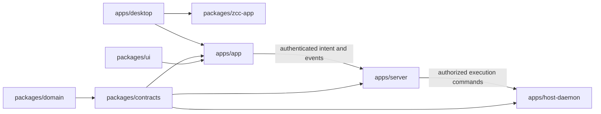
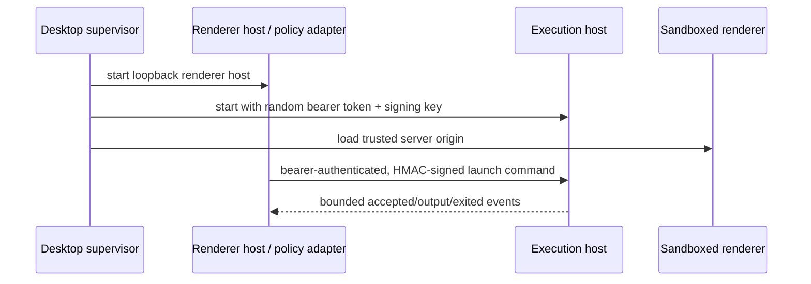

# Runtime Monorepo

## Status

In progress. This document is the migration contract for the pnpm workspace
introduced on the `feat/runtime-server-host-migration` branch.

## Target

## Authority Model

The renderer, CLI, agent tools, host daemon, and disk extensions are callers,
not authorities. The server validates identity, registered project ownership,
path confinement, policy, and grants before it emits an execution command.
The host daemon validates the serialized protocol again but does not infer a
new project root, executable, or permission grant. It returns bounded events;
the server alone writes durable product state.

## Package Rules

| Package | Allowed responsibility | Prohibited dependency |
| --- | --- | --- |
| `domain` | Serializable product vocabulary | Electron, React, storage, PTY, service imports |
| `contracts` | Zod schemas and serializable protocol messages | BrowserWindow, ChildProcess, mutable services |
| `ui` | Generic host UI tokens and prop-driven primitives | IPC calls, stores, routes, extension policy |
| `extension-sdk` | Public extension API only | Internal workspace packages |
| `zcc-app` | Built runtime composition and supervision | Source-tree copies at runtime |

## Compatibility Phase

The existing root Electron application remains a compatibility host until a
capability is migrated end-to-end. `apps/app` and `apps/desktop` currently
delegate to the legacy build so package manager and task graph conversion can
be validated independently from behavior migration. A capability moves only
after its contract, server adapter, host implementation, and packaged-Electron
coverage are all in place.

## First Runtime Slice

The first live slice runs three local services under Electron lifecycle ownership:

The server and host packages already enforce a concrete command boundary. The
current Electron main process still owns the legacy launch authority and is
therefore a compatibility adapter, not yet a thin desktop shell. A later slice
must move that authority into `apps/server` before product calls are rerouted.

## Native Dependency Policy

pnpm's build-script policy explicitly allowlists Electron and ZCC's existing
native dependencies in `pnpm-workspace.yaml`. The allowlist is intentionally
small and must be reviewed when a new install script is introduced.
