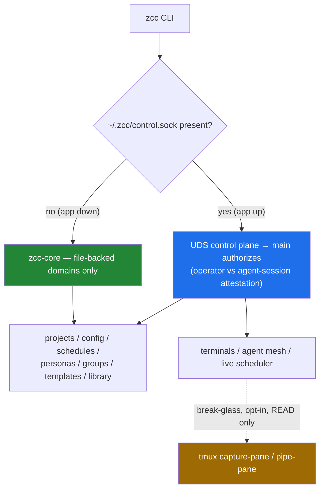

# `zcc` CLI — Design Draft & Pro/Con

**Date:** 2026-06-15
**Status:** Brainstorm draft for review — produced by a 4-lens design team (transport/architecture, command-surface/UX, tmux/orchestration, security/risk), grounded in a full sweep of the current control surface.
**Goal:** A CLI to control *specific* actions of Zana Command Center across six domains — app, project, terminals, agent control + interaction (leveraging TMUX), scheduler, persona — without mirroring the GUI.

---

## 0. TL;DR — the four decisions that define the design

The four lenses converged on the same architecture. In one breath:

1. **Substrate split is the real architecture.** State is either *file-backed declarative* (projects, config, schedules, personas, groups, templates, library) or *live process-bound* (terminals, agent registry, running schedule execution). The transport differs per substrate.
2. **Transport = hybrid:** a **Unix-domain control socket** in main (`~/.zcc/control.sock`, `0600`) for live + authorized writes when the app is up; a **`zcc-core` library** operating directly on `~/.zcc/` files for reads and for the app-down case. **tmux-direct** is a labeled escape hatch for reads only.
3. **Command grammar = `zcc <noun> <verb>`**, six nouns, with top-level sugar (`zcc run`, `tail`, `send`, `ask`, `ls`). Small and sharp, not a GUI mirror.
4. **The keystone risk: every agent ZCC spawns has a shell, so `zcc` on `PATH` hands the app's control surface to every agent.** "Local + has token" is NOT identity here — every agent is local and same-uid. The transport must distinguish **operator** (human at keyboard) from **agent-session** caller from day one, and the **unattended-bypass-on-cron** combination must be structurally impossible from the CLI.



---

## 1. What exists today (grounding)

A control surface sweep of the repo established:

- **No external entry point exists** except the MCP HTTP server (`127.0.0.1:<ephemeral>`, routes `/mcp/:projectId[/:sessionId]`, identity baked un-forgeably into the URL). No CLI control plane, no socket, no daemon. The current `packages/cli` is a **stdout-only file reader** with zero live channel to the app.
- **Durable state is files** under `~/.zcc/`: `projects.json`, `config.json`, `schedules/*.json`, `personas/*.json`, `groups.json`, `inbox/` (append-only), `templates/`, `library/`. Writes are atomic tmp+rename; read-modify-write is **in-process** mutex-serialized (does NOT span processes). Pervasive file watchers reload on change.
- **Authority lives in main** (CLAUDE.md #1/#2): a renderer-/agent-supplied path is trusted only after `realpath`-matching a registered project or HOME/cloneRoot base.
- **Terminals** are node-pty, capped at 50 live. When `config.tmuxPersistence` is on, each is wrapped `tmux new-session -A -s cc-<sessionId>`. A boot-time reaper kills orphan `cc-*` sessions (10s grace).
- **Agent status is already known to the app**: OSC-title spinner = `working`, ✳ = `idle`, Notification hook = `blocked`, Stop hook = `done`, streamed as `onAgentStatus`. There's an in-memory registry (handle/role/capabilities → un-forgeable sessionId) and a mesh (`register/list/find/agent_send/agent_inbox`); `agent_send` best-effort injects when idle (via `pty.reply` — text + deferred CR to defeat TUI paste-buffering), else queues. `agent_send` is the one mesh tool that is **not** pre-approved (first send → user consent).
- **Scheduler & personas are file-backed with main-side stores + watchers but NO programmatic create/update** today (personas are read-only; schedules have IPC CRUD but no agent-facing API). `zcc-core` extraction is feasible — stores' only Electron dependency is `app.getPath('home')` for `dataDir`.

---

## 2. Transport — options & recommendation

| # | Option | Reaches | App-down? | AuthZ story | Verdict |
|---|---|---|---|---|---|
| 1 | **New UDS control plane in main** | everything main can (files + live) | ✗ dead | **Best** — CLI is untrusted client; main confines identically to IPC; `SO_PEERCRED` uid check; fixed path (no port discovery) | **Primary (writes + live)** |
| 2 | Extend existing MCP HTTP server | same as 1 | ✗ dead | Forces port-discovery onto a deliberately-undiscoverable server; two auth regimes in one listener (confused-deputy risk) | Fallback to 1 only |
| 3 | **Extract `zcc-core` library** | file-backed only | ✓ works | OS file perms (user owns files); confinement re-checked in-core; **must defer to socket when app is up** to avoid cross-process RMW races | **Primary (app-down + fast reads)** |
| 4 | Direct file writes by CLI | file-backed | ✓ works | None — re-implements the on-disk contract, races the mutex, file-write→code-exec via scheduler | **Reject standalone** (OK only *as* zcc-core's engine) |
| 5 | Headless Electron + IPC | in principle all | ✗ | IPC has no out-of-process door; spawning Electron-per-command is grotesque; "make main callable sans-renderer" *is* option 3 | **Reject** |
| 6 | **tmux-direct** | live terminals only, persistence-on only | partial (survives app) | **None** — raw keystroke injection into possibly-YOLO shells; bypasses un-forgeable sessionId | **Reads only, labeled escape hatch** |

### Recommended hybrid, routed by domain

| Domain | App up | App down |
|---|---|---|
| app (status/version/config) | control socket | socket-absent *is* the "not running" answer; `zcc-core` reads config |
| project / scheduler / persona / groups / templates / library / config | control socket → main confines & serializes | `zcc-core` files (sole writer; confinement re-checked) |
| terminal (spawn/send/kill/list) | **control socket only** | unavailable (tmux read-only escape hatch if persistence on) |
| agent mesh (list/find/send/inbox) | control socket → reuses un-forgeable sessionId | unavailable (registry is in-memory) |
| inbox | socket *or* direct append (append-only is race-safe) | `zcc-core` append |

**Hard rules that make the hybrid safe:**
1. **One writer per file at a time, by construction.** App up → CLI never does file RMW; it routes through the socket so main's mutex stays the single serialization authority. App down → CLI is sole writer. Eliminates lost-update races without a cross-process lock. Only append-only/unique-suffixed files (inbox) may be CLI-written while app is up.
2. **Confinement lives in `zcc-core`, consumed by both main and CLI** — one copy of CLAUDE.md #2, no drift.
3. **`zcc-core` never grows a live-resource method** (no `spawnTerminal`, no `sendToAgent`). Those are socket-only.
4. **Reads from files freely (atomic rename ⇒ no torn read); writes through the socket whenever the app is up.**
5. **UDS over TCP**: kills the ephemeral-port discovery problem, gives `SO_PEERCRED`, keeps MCP undiscoverable, and closes the browser CSRF/DNS-rebinding class (browsers can't open AF_UNIX). Token file (`0600`) + per-boot nonce as defense-in-depth. Windows needs a named-pipe shim.

---

## 3. Command grammar & the IN/OUT line

**Style:** `zcc <noun> <verb> [args] [--flags]` — noun-first (scales tab-completion by domain; matches "I have an X, what can I do to it"). Hot-path sugar: `zcc run`, `zcc tail`, `zcc send`, `zcc ask`, `zcc ls`. Bare `zcc` → read-only status dashboard.

**Global flags:** `--json` (machine; single object or NDJSON for streams), `-q/--quiet` (values only, clean `$(...)`), `-v` (diagnostics→stderr), `--yes/-y`, `-p/--project <id|name>`, `--no-color`.

**ID/name resolution (uniform):** exact-id → exact-name → unique case-insensitive prefix; ambiguous → exit 3 with candidates. `--json` always echoes both `id` and `name`.

| Domain | IN | OUT | Why OUT |
|---|---|---|---|
| **app** | `version`, `update [--check\|--install]`, `config get`, `config set` (allowlisted keys; bypass-mode guarded), `home` | window/tabs/views, `quit`, `focus` | renderer-only, or "quit from script" kills others' agents |
| **project** | `list`, `show`, `add`, `clone`, `add-remote`, `update`, `touch` | `reorder`, `pickDirectory`, `ensureQuickAgent`; **`remove` only via `--id --force --yes`** | GUI-presentation / native-only / highest-regret cascade |
| **term** | `list`, `tail`, `create`, `reply`, `write`(advanced), `close`, `resize`; `--profile claude-yolo` **guarded** | `setHeadless` | internal toggle; headlessness owned by `run --detach` / scheduler |
| **agent** | `list [--status]`, `show`, `send`, `ask [--wait]`, `broadcast` (must be scoped), `inbox`, `reply`, `attach` | `register`, `find` as user verbs | agents self-register via MCP; manual registration pollutes the registry |
| **sched** | **full CRUD** + `enable/disable`, `run-now [--wait]`, groups, templates | — (but yolo/bypass schedules **hard-NO via CLI**) | config artifacts — the CLI sweet spot |
| **persona** | `list`, `show` | create/update/delete | **API doesn't exist yet — don't fake it.** Build it file-first (like schedules), then add `persona create -f`. |

---

## 4. Agent interaction — the centerpiece

Three distinct intents → three verbs (don't collapse them):

- **`zcc agent send <handle> "msg"`** — fire-and-forget push (maps to `agent_send`): best-effort inject if idle, else queued. Returns immediately.
- **`zcc agent ask <handle> "prompt" [--wait --timeout 5m]`** — run-and-capture against an *existing* live agent. `--wait` blocks until `idle`/`done` (using the app's existing status detection — **not** pane-scraping), prints captured output; timeout → exit 124, session keeps running.
- **`zcc run -p <proj> [--persona X] "prompt" [--wait|--detach]`** — *spawns* a fresh session (= `term create` + inject + optional wait). The single most useful command; `--detach` is the legitimate home for headless.
- **`zcc tail <id> [--follow]`** — read-only output stream (tmux `capture-pane` or pty buffer). **`zcc agent attach <handle>`** — the one interactive two-way bridge (under tmux, literally `tmux attach`); explicit, never default.
- **`zcc agent broadcast "msg" --role R -p X`** — fan-out; **always requires a filter** (`--all` must be typed).

**tmux orchestration — the read/write boundary (the safe line):**
- **Reads → tmux-direct** (`capture-pane -S -N -p`, `pipe-pane`, `list-sessions`; works over ssh, offloads the app loop). Must strip ANSI/redraw noise; for *structured* handoffs prefer the app's data buffer / message-log over the pane screenshot.
- **Writes → app-mediated always** (reuse `reply()`'s deferred-CR; gate on the existing idle detection; queue if busy). Raw `tmux send-keys` into a live Claude pane is a **hard NO** — it corrupts the TUI and is ungoverned injection.
- **`--wait-idle`-then-send is edge-triggered** off the app's `onAgentStatus` stream — never poll `capture-pane`.
- **Hazards handled:** orphan reaper (CLI must NOT mint `cc-*` sessions — spawn via app so a pty owns them); `tmuxPersistence` OFF is the default ⇒ tmux-direct is an *optimization with an app-mediated floor*, never the only path; handle→sessionId→tmux-name resolution happens in the app (CLI never constructs `cc-<x>` from user input).

**The one new affordance to build:** a read-only **status/identity endpoint** exposing `[{handle, sessionId, tmuxName|null, state, projectId, host|null}]` + the `onAgentStatus` edge feed. Every orchestration recipe (fan-out, wait-then-step, broadcast, multiplexed watch) composes from this + the existing `reply`/registry primitives.

**Scripting feel & exit codes:**
```bash
sid=$(zcc run -p api --persona reviewer "audit error handling" --detach -q)
zcc tail "$sid" --follow
zcc agent ask reviewer "does auth.ts handle refresh?" --wait --json | jq -r .output
```
| code | meaning | | code | meaning |
|---|---|---|---|---|
| 0 | success | | 4 | resource limit (50-pty cap) |
| 1 | generic error | | 5 | refused by guard (yolo/bypass w/o `--yes`) |
| 2 | bad usage | | 124 | `--wait` timeout |
| 3 | id/name ambiguous or not found | | | |

---

## 5. Security — ranked risks & guardrails

| Risk | Sev | Mitigation |
|---|---|---|
| **Agent self-escalation** (agent runs `zcc`, inherits full control, bypasses MCP consent) | **HIGH** | Caller-class attestation: operator (human) vs agent-session. Agent-class mutates route through the *same* consent path as `agent_send` (first mutate → UI prompt) and are confined to their own project. Read tier ambient; mutate tier not. |
| **Transport auth** (any same-uid process / browser CSRF / token leak) | **HIGH** | UDS `0600` + dir `0700` (closes browser & cross-uid classes) + per-request token + per-boot nonce. Token alone ≠ identity (agents are same-uid) → combine with attestation. |
| **Path confinement from arbitrary cwd** (`zcc term create --cwd /etc`) | **HIGH** | CLI is never a trust anchor; main `realpath`-confines to a registered project / HOME / cloneRoot before granting. Require explicit `--project`/`--cwd`, then confine. |
| **bypassPermissions / claude-yolo / scheduled-yolo** | **HIGH** | Global `permission-mode=bypassPermissions`: interactive-only, never scripted, never agent-class. Spawning yolo: gated + UI flag. **Scheduling a bypass agent: hard NO via CLI** — CLI may write a *disabled draft*, only the UI can arm it. |
| **Concurrent `~/.zcc/` writes** (CLI vs app mutex + watcher) | **MED-HIGH** | Go through main when app is up (single serialization point). App-down direct writes use the same atomic tmp+unique-suffix+rename + a cross-process lockfile; "app running" = error, not direct-write fallback. |
| **Agent injection** (send-keys / `agent send` into working or bypass agent) | **HIGH** | No raw send-keys into live panes. Injection goes through inbox/`agent_send` consent semantics; into a bypass agent → always-confirm regardless of prior approval. |
| **Auditing/attribution** | **HIGH** | Append-only audit log (routed through main, agents can't truncate): timestamp, caller class+identity, command, target, consent outcome. Surface mutates in the UI near-real-time. |
| Destructive cascades (`project remove`, `kill-all`, inbox delete) | MED | Typed confirm + explicit scope; agent-class needs UI prompt; consider soft-delete/tombstone; `kill-all` lists sessions first. |
| Resource exhaustion (`term create` loop) | MED | Enforce 50-pty cap in main with clean error; rate-limit mutates per caller; per-session terminal quotas. |

**Hard-NO list:** global bypassPermissions via any scripted path; create/arm a yolo/bypass schedule; raw `tmux send-keys` into live panes; direct `~/.zcc/` writes while app runs; trusting a CLI-supplied path without main confinement; an ambient operator-grade token readable by spawned agents; granting operator authority purely on "local + has token."

**Gated list (operator-class + explicit confirm/flag):** `config set` sensitive keys; `term create` (confined cwd; yolo always confirms); non-bypass `sched create/enable`; `agent send` (mirrors first-send consent); `project add`/`clone` (confined to bases); destructive ops; `kill`/`kill-all`.

---

## 6. Recommended build order

**Tier 1 (≈80% of value):** `zcc-core` extraction (the `dataDir` seam) + the UDS control plane with operator/agent attestation + the read-only status/identity endpoint → then `zcc run`, `zcc tail`, `zcc agent ask --wait`, `zcc sched` CRUD, and all read verbs (`ls`, `show`, bare-`zcc` dashboard).

**Tier 2:** `zcc agent attach`, `broadcast`, raw `term write`, `project remove --force`, tmux-direct read optimizations (fan-out/`tail --if working`/multiplexed `watch`).

**Tier 3 / blocked:** persona write (build the file-first persona CRUD API in the app first, then `persona create -f`); remote (ssh) orchestration polish.

---

## 7. Open questions for the human

1. **Operator vs agent-session attestation** — accept this as the core auth primitive? It's the spine of the whole security story.
2. **App-down writes** — do we want the `zcc-core` direct-file path at all, or is "CLI controls a *running* app, error if down" acceptable for v1? (Simpler, safer; loses cron/CI-without-app use.)
3. **`zcc run` semantics** — is "spawn fresh session" (vs `agent ask` = inject into existing) the right division?
4. **Persona write** — confirm we build it file-first in the app before exposing any CLI write.
5. **Scope for v1** — ship Tier 1 only, or pull `attach`/tmux orchestration into the first cut since that's the most-wanted capability?

---

## 8. Implementation status (2026-06-15)

**v1 decisions (confirmed with the user):** Tier-1 + status endpoint · running-app-only (socket required, errors if down) · operator-vs-agent-session attestation baked into the transport.

**Shipped:**
- `src/main/control-plane.ts` — UDS at `~/.zcc/control.sock` (0600), NDJSON one-request-per-connection, token+per-boot-nonce auth (`~/.zcc/control.token`, atomic tmp+rename, **constant-time compare**), operator-vs-agent attestation, op dispatch. Connection cap (64) + 10s timeout + 256KB cap.
- `src/main/index.ts` — `startControlPlane` wired into `whenReady`, torn down in `before-quit`; `createTerminalConfined()` extracted and **shared** by the IPC handler and the control plane, now with **realpath** confinement (symlink-escape-proof).
- `src/main/pty.ts` — injects `ZCC_SESSION_ID` into every spawned pty (incl. shell) so a CLI invoked *by* an agent is attested as agent-class.
- `packages/cli/` — `lib/control-client.ts` (socket probe, token read, `ZCC_SESSION_ID` forwarding) + new verbs in `run-cli.ts`: `status`, `agent ls/send`, `term ls/close`, `run [--persona --profile --wait --timeout]`, `schedule run-now/enable/disable`. File-backed read verbs unchanged.
- Tests: 20 control-plane unit tests (auth, attestation, agent-mutation refusal, confinement delegation, NOT_FOUND) + 4 CLI control-client tests. Full suite green (832 root + 26 CLI). Verified end-to-end against the real binary + real socket.

**Known limitation (documented in code, not hidden):** the operator-vs-agent gate is **defence-in-depth, not a hard wall**. Two same-uid processes can't be cryptographically distinguished — an *adversarial* agent can `unset ZCC_SESSION_ID` and read the same 0600 token a human can, presenting as an operator. A *naive* agent that just runs `zcc` is correctly restricted. Mutating ops are additionally confined (realpath), so even an escalated caller can't spawn outside a registered project. Closing the gap fully needs a v2 out-of-band operator secret never placed in pty env, or true per-process isolation.

**Not yet built (deferred per v1 scope):** app-down `zcc-core` writes, tmux-direct read optimizations (`tail --follow`, fan-out, multiplexed watch), `agent attach`, persona write (blocked on the file-first persona CRUD API).

## 9. Review round (4-engineer team, 2026-06-15)

A read-only review team (security · correctness · architecture · CLI/DX) audited the diff. **Verdict: architecture FITS the codebase, security GO for single-user v1.** Fixes applied this round:

- **Correctness (HIGH):** `run --wait` no longer false-times-out on a single dropped poll — it tolerates a run of consecutive failures and returns a distinct exit 1 ("lost contact") instead of a bogus 124.
- **Correctness/DX (HIGH):** `run` now supports a `--` end-of-flags sentinel (prompt text containing `--wait` etc. is no longer misparsed) and recognizes `--detach`; `--wait`+`--detach` together is exit 2; bad `--timeout` is rejected before spawn.
- **Security (H1):** `constantTimeEqual` now SHA-256-hashes both sides then `timingSafeEqual`s the digests — no length branch to leak through (the old "burn" compared the caller's own buffer).
- **Security (M2):** per-field size caps on the values that reach a live TTY/argv (`prompt` ≤32k, `reply`/`message` ≤16k); unknown `profile` rejected; `cols`/`rows` clamped (NaN/0/negative → fallback).
- **DX (HIGH):** the 50-pty cap now surfaces as a distinct `RESOURCE_LIMIT` code → **exit 4 is reachable** (was collapsing to generic exit 1); `exitCodeForControl` rounded out.
- **Correctness (MED):** `status` dashboard default-destructures so a partial server shape can't crash the render; project resolution now reports **ambiguous** (with candidates, exit 3) distinctly from not-found.
- **Architecture/security (cleanup):** removed the dead `isLiveSession` parameter threaded through `classifyCaller`/`authorizeRequest`; control-plane op faults now logged in-app, not only on the wire; stale `tail` comment fixed.

**Test coverage added** (closing the gaps the team named): real-socket integration tests for NDJSON framing (multi-chunk, newline-straddle, no-newline-then-end), token-file 0600 + teardown, bad-token-over-wire; `run` tests for the `--` sentinel, `--wait`/`--detach` conflict, ambiguous project, and the poll-resilience (single drop tolerated / sustained drop → exit 1). Full suite green: **858 root + 32 CLI**.

**Deferred to follow-ups (documented, by design):** `-q/--quiet` + fix `-v`→version-only alias collision, `agent ask --wait`, uniform id/name resolution across all verbs (today only `run`'s project resolves names), bare-`zcc`→dashboard alias, a `protocolVersion` field in the wire envelope (CLI ships on a separate cadence from the app), and the v2 out-of-band operator secret that would make the operator/agent boundary a hard wall rather than defence-in-depth.
