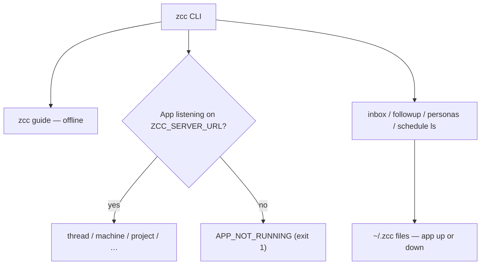

# `zcc` CLI Reference

`zcc` is the command-line companion to Zana Command Center (ZCC). It has no
long-running process of its own. Almost every command talks to the **running
app** over the **product HTTP API** (`ZCC_SERVER_URL`, default
`http://127.0.0.1:8780`). A few file-read and scaffold commands still work
with the app down.



Prefer product nouns: `thread`, `machine`, `project`, `skill`, `settings`,
`terminal`, `environment`. `zcc run` and `zcc agent send` are **deprecated
aliases** of `thread spawn` and `thread tell`. `zcc term` aliases `terminal`
(except `term reply` / `term close-summary`, which still use the control plane).

`zcc --help` is the flag surface. `zcc guide [chapter]` is the long-form
companion and works with no app. Keep this page, the `zcc-cli` skill, and
`--help` in lockstep (`docs/cli-guide-and-skill.md`).

> Related: [`../packages/cli/README.md`](../packages/cli/README.md).

---

## Overview & install

The CLI lives in the monorepo at `packages/cli`. From the repo root:

```bash
pnpm install
pnpm --filter @zcc/cli build

node packages/cli/dist/bin/zcc.js status --json

export PATH="$PWD/packages/cli/dist/bin:$PATH"
zcc thread list --json
```

Packaged desktop builds also put `zcc` on `PATH` for terminals the app
spawns. Throughout this doc, `zcc` means either form.

### Tiers

| | Offline / file | Product HTTP | Control plane |
|---|---|---|---|
| Commands | `guide`; `plugin new` / `types` / `build`; `inbox` / `followup` / `personas ls` / `schedule ls` | `status`, `thread *`, `machine *`, `project *` / `projects ls`, `skill *`, `settings *`, `terminal *`, `environment *` | `plugin` install/dev/…, `marketplace *`, `agent ls`, `team ls`, `term reply` / `close-summary`, `schedule run-now` / enable / disable |
| App must be running? | **No** (`guide` and file reads) | **Yes** | **Yes** |
| Override | — | `ZCC_SERVER_URL` | `~/.zcc/control.sock` + token |

Missing or malformed store files on the file-read path never crash the CLI —
empty list + stderr warning, exit `0`.

---

## Every command

This mirrors `zcc --help`:

```text
OFFLINE (no app required):
  guide [chapter]          Print a chapter (overview, threads, projects, machines,
                           terminals, plugins, automations, agent-configuration,
                           environments)
  plugin new <name>        Scaffold a TypeScript plugin (package.json zcc)
  plugin types [dir]       Sync bundled SDK .d.ts into the plugin [--check]
  plugin build [dir]       Bundle zcc.app / zcc.server for CI

PRODUCT API (app must be running — ZCC_SERVER_URL, default http://127.0.0.1:8780):
  status                   Live dashboard: projects and threads
  thread list [--project ID]
  thread spawn --project <id> --prompt "..." [--provider <id>] [--wait]
  thread show|log|tell|wait|stop|fork|archive|unarchive|interactions <id>
  thread open <id> [--file PATH] [--source workspace|thread-storage] [--line N]
  machine list|show|join-code|rename|remove|provider-cli
  project list|show|create|files|content|skills
  projects ls              Alias of project list
  skill list|show|files|cli-skills-status|install-cli-skills
  settings show|general|experiment|appearance
  terminal list|create|send|close
  environment status|diff|diff-files|pull-request <id>
  run <project> <prompt>   Deprecated alias of thread spawn
  agent send <id> <msg>    Deprecated alias of thread tell
  term ls|close            Deprecated aliases of terminal list|close

FILE READS (work if the app is down; prefer HTTP groups above when it is up):
  personas ls              List personas
  schedule ls              List scheduled tasks
  inbox ls [--project ID]  List inbox entries
  inbox show <id>          Show full inbox entry
  followup ls              List follow-ups (parked questions/decisions)

LIVE CONTROL PLANE (app must be running):
  plugin ls|install|enable|disable|reload|remove|dev|search|outdated|update|run|logs
  marketplace ls|add|refresh|remove|install
  agent ls                 List live agents + their state
  team ls                  List the team catalogue
  term reply <sessionId> <message>
  term close-summary <projectId> <sessionId...>
  schedule run-now|enable|disable <id>
```

I made a typo: `pull-return` should be `pull-request`. Fix that.

### Product verbs (preferred)

```bash
zcc status --json
zcc thread spawn --project <id> --prompt "…" [--wait]
zcc thread list|show|tell|wait|stop
zcc machine list
zcc project list
zcc skill install-cli-skills
zcc terminal list
zcc guide [chapter]
```

`zcc run <project> <prompt>` → `thread spawn`. `zcc agent send <id> <msg>` →
`thread tell`.

### `status`

Compact live dashboard: project count, live threads/agents, and related
state. **Product HTTP — needs the app running.**

```bash
zcc status
```

```text
Zana Command Center — live
Projects: 4

Agents (2):
  reviewer	idle	code-reviewer
  builder	working	implementer

Enabled schedules (1):
  nightly-review	every 1d
```

```bash
zcc status --json
```

```json
{
  "projects": 4,
  "agents": [
    { "handle": "reviewer", "state": "idle", "role": "code-reviewer" }
  ],
  "enabledSchedules": [
    { "name": "nightly-review", "every": "1d" }
  ]
}
```

### `projects ls` / `project list`

List every registered project. **`projects ls` is an alias of `project list`.**
With the app running this hits the product HTTP API; it is not a disk-only
read of `projects.json`.

```bash
zcc projects ls
```

```text
ID        NAME       TAG   PATH
--------  ---------  ----  ----
a1b2c3d4  api        api   /Users/me/code/api
e5f6a7b8  webapp     web   /Users/me/code/webapp
```

```bash
zcc projects ls --json
```

```json
[
  {
    "id": "a1b2c3d4-....",
    "name": "api",
    "path": "/Users/me/code/api",
    "tag": "api",
    "createdAt": 1718000000000,
    "lastActiveAt": 1718400000000
  }
]
```

The human table truncates the `id` to its first 8 characters; `--json` returns
the full record.

### `personas ls`

List personas merged from the global store (`~/.zcc/personas/*.json`) and each
project's `<project>/.zcc/personas/*.json`. **Read tier.**

```bash
zcc personas ls
```

```text
ID         NAME       PROFILE  SOURCE
---------  ---------  -------  ------
reviewer   Reviewer   claude   global
api-arch   Architect  claude   api
```

The `SOURCE` column reads `global` for user-level personas, `builtin` for
builtin ones, the owning project's name for per-project personas, or the
extension's title for an extension-contributed persona (`source.extensionId`).

> Builtin personas (`builtin:reviewer`, `builtin:architect`) live in code, not
> on disk, so they do **not** appear here. When no file-backed personas exist
> the command prints a note saying so and still exits `0`.

```bash
zcc personas ls --json
```

### `team ls`

List the team catalogue (builtins, file-backed teams, and plugin contributions).
**Live tier — needs the app running.**

```bash
zcc team ls
zcc team ls --json
```

### `schedule ls`

List scheduled tasks from the global store (`~/.zcc/schedules/*.json`) and
per-project `<project>/.zcc/schedules/*.json`. **Read tier.**

```bash
zcc schedule ls
```

```text
ID        NAME            ENABLED  EVERY  PROJECT  LAST-RUN
--------  --------------  -------  -----  -------  --------
9f8e7d6c  nightly-review  yes      1d     api      success
1a2b3c4d  hourly-sync     no       1h     webapp   -
```

```bash
zcc schedule ls --json
```

The `LAST-RUN` column reflects `status.lastRunResult` (`success` / `error` /
`skipped`, or `-` if never run).

### `inbox ls [--project ID]`

List the 20 most recent inbox entries (newest first), optionally filtered by
project. **Read tier.** Reads `~/.zcc/inbox/entries.jsonl`.

```bash
zcc inbox ls
```

```text
ID        TIMESTAMP            PROJECT  PREVIEW
--------  -------------------  -------  -------
3c4d5e6f  2026-06-15 09:12:04  api      Nightly review: 2 findings in auth.ts...
7a8b9c0d  2026-06-14 22:00:00  webapp   Hourly sync completed, no changes
```

`--project` accepts either a project **id** or a project **tag** — a tag is
resolved to its id before filtering:

```bash
zcc inbox ls --project api          # by tag
zcc inbox ls --project a1b2c3d4-... # by id
zcc inbox ls --project api --json
```

### `inbox show <id>`

Show a full inbox entry — project, timestamp, attached documents, and the full
comments body. **Read tier.**

```bash
zcc inbox show 3c4d5e6f
```

```text
Inbox Entry: 3c4d5e6f-....
Project: api
Timestamp: 2026-06-15T09:12:04.000Z

Documents:
  - /Users/me/code/api/reports/nightly-2026-06-15.md

Comments:
Nightly review: 2 findings in auth.ts
- refresh token not rotated on re-auth
- missing rate-limit on /login
```

`<id>` matches an exact entry id, or a **unique id prefix**. If a prefix matches
more than one entry the newest is shown and a disambiguation warning is printed
on stderr (use a longer prefix). Omitting the id entirely is a usage error and
exits `2`; supplying an id that matches no entry exits `1` (not found).

```bash
zcc inbox show 3c4d5e6f --json
```

### `agent ls`

List live agents and their current state. **Live tier.**

```bash
zcc agent ls
```

```text
reviewer	idle	a1b2c3d4	code-reviewer
builder	working	e5f6a7b8	implementer
```

Columns are tab-separated: `handle`, `state`, short `sessionId`, `role`. With no
live agents it prints `No live agents.`

```bash
zcc agent ls --json
```

### `agent send <handle> <msg>` (deprecated)

**Deprecated alias of `zcc thread tell`.** Prefer `zcc thread tell <id> "…"`.

Send a message to a live agent by handle. The app best-effort injects it if the
agent is idle, else queues it. **Product HTTP — mutating.**

```bash
zcc agent send reviewer "PR #214 is ready for a look"
```

```text
Delivered to @reviewer (id=msg-7f3a)
```

Everything after the handle is joined into the message, so quoting is optional
but recommended. Both a handle and a non-empty message are required (else exit
`2`).

```bash
zcc agent send reviewer "ack" --json
```

### `term ls` / `terminal list`

`zcc term ls` is a **deprecated alias of `zcc terminal list`**. Prefer
`terminal list`.

List live terminal sessions, optionally scoped to one project. **Product HTTP.**

```bash
zcc term ls
zcc term ls --project api
```

```text
a1b2c3d4	claude	running	Reviewing auth.ts
e5f6a7b8	shell	idle	zsh
```

Columns: short `sessionId`, `profile`, `status`, `title`. With no sessions it
prints `No live sessions.` Use `--json` for the full records.

### `term close` / `terminal close`

`zcc term close` is a **deprecated alias of `zcc terminal close`**.

Close one live session. **Product HTTP — mutating.**

```bash
zcc term close a1b2c3d4
```

```text
Closed.
```

A missing session id is exit `2`.

### `term close-summary <projectId> <sessionId...> [--no-summary]`

Summarize one or more sessions' work into the inbox, then close them. Pass
`--no-summary` to close without writing a summary. **Live tier — mutating.**

```bash
# Summarize two sessions to the inbox, then close both
zcc term close-summary a1b2c3d4 sess-abc sess-def

# Close without summarizing
zcc term close-summary a1b2c3d4 sess-abc --no-summary
```

The first positional is the **project id**; every positional after it is a
**session id** (at least one is required, else exit `2`). `--no-summary` may
appear anywhere among the positionals.

### `run <project> <prompt> [flags]` (deprecated)

**Deprecated alias of `zcc thread spawn`.** Prefer:

```bash
zcc thread spawn --project <id> --prompt "…" [--wait]
```

The flags below still apply to `zcc run` for compatibility. **Product HTTP —
mutating.** See [The `run` command in depth](#the-run-command-in-depth).

```bash
zcc run api "review the diff in src/auth" --persona reviewer --wait
```

| Flag | Meaning |
|---|---|
| `--persona <id>` | Launch under a persona |
| `--profile <p>` | Launch profile (default `claude`) |
| `--wait` | Block, polling until the agent is `idle`/`done` (or timeout) |
| `--detach` | Return the session id immediately (the default; explicit for docs) |
| `--timeout <dur>` | Wait bound, e.g. `30s`, `5m`, `2h` (default `5m`) |

`--wait` and `--detach` are mutually exclusive (exit `2`).

### `schedule run-now <id>`

Fire a schedule once, immediately. **Live tier — mutating.**

```bash
zcc schedule run-now 9f8e7d6c
zcc schedule run-now nightly-review --json
```

### `schedule enable <id>` / `schedule disable <id>`

Enable or disable a schedule. **Live tier — mutating.**

```bash
zcc schedule enable 9f8e7d6c
zcc schedule disable 9f8e7d6c
```

A missing schedule id is exit `2` for all three `schedule` live verbs.

### `plugin` / `marketplace`

Plugins are full-trust TypeScript packages (`package.json` → `zcc`). Scaffold and
inspect without the app; install, enable, and marketplace ops need it running.
See the [Plugins overview](./extensions.md) and
[plugin quickstart](./extensions-quickstart.md).

```bash
# Scaffold + path-install a local plugin
zcc plugin new hello --app
cd zcc-plugin-hello
zcc plugin install .
zcc plugin dev

zcc plugin ls
zcc plugin enable <id>
zcc plugin reload <id>
zcc plugin logs <id> -f
zcc plugin search tasks
zcc plugin outdated
zcc plugin update <id>

# Official catalog (the website serves this feed)
zcc marketplace add https://<PUBLIC_BASE_URL>/marketplace/v1/marketplace.json
zcc marketplace ls
zcc marketplace install tasks@official
```

`plugin ls` / `new` / `types` / `build` work with the app down. `plugin install`,
`enable`, `disable`, `reload`, `remove`, `dev`, `search`, `outdated`, `update`,
`run`, and every `marketplace` verb are **live tier**.

`plugin logs <id>` prints persisted JSONL from the plugin log (`-n N`, `-f` to
follow). `plugin run <id> <args…>` runs a CLI contribution declared by that
plugin.

---

## The `run` command in depth

`zcc run` is a **deprecated alias of `thread spawn`**. It creates a new session
in a project, injects the prompt, and (optionally) waits for the agent to
finish. The app must be running (`ZCC_SERVER_URL`).

### Project resolution

The `<project>` argument is resolved in this order (case-insensitive for the
prefix step):

1. exact **id** match
2. exact **tag** match
3. exact **name** match
4. **unique name prefix** match

If a name prefix matches more than one project, that is **ambiguous** — the CLI
exits `3` and lists the candidates rather than guessing. A reference that
matches nothing also exits `3`.

```bash
zcc run api "audit error handling"     # tag → resolves
zcc run web "fix the header"           # unique name prefix → resolves
zcc run a1b2c3d4-... "..."             # full id → resolves
# If both "webapp" and "website" exist:
zcc run web "..."                      # ambiguous → exit 3, lists webapp, website
```

> Note: the prefix step matches on **name** only. A unique id or tag *prefix*
> does not resolve — use the full id/tag or the name prefix.

### The `--` prompt sentinel

A prompt that contains flag-like tokens (`--wait`, `--json`, `--data-dir`, …)
would otherwise be misread as CLI flags. Put a bare `--` before such a prompt:
**everything after the first `--` is the literal prompt, verbatim, and is never
scanned for flags** — neither the `run`-level flags nor the global ones.

```bash
# "--wait" here is prompt text, not the wait flag
zcc run api -- review the --wait handler

# Recently fixed: global flags after `--` are now also treated as literal text.
# This prompt keeps "--json" as words; it does NOT switch on JSON output:
zcc run api -- explain the --json output format

# Likewise "--data-dir" after `--` is literal and does NOT repoint the store:
zcc run api -- document the --data-dir flag
```

This was the Major bug noted in the verification report and is now fixed: the
global-flag vs. `--`-tail split happens **once at the top level**, so
`--json` / `--data-dir` appearing inside a `-- …` prompt tail are preserved as
text.

> Because of this, a real global flag must come **before** the `--` sentinel
> (see [Global options](#global-options)).

Without `--`, flags may appear anywhere (back-compat), so any prompt that
contains a genuine flag-like token should use the sentinel.

### `--wait` vs. `--detach`

- **`--detach`** (the default): spawn and return the session id immediately.
- **`--wait`**: spawn, then poll the session's status every 1.5s until it
  reaches `idle` or `done`, or the timeout elapses.

The two are mutually exclusive (specifying both is exit `2`).

```bash
# Detached (default): prints the session id and returns
zcc run api "kick off the nightly audit"
# → a1b2c3d4-....

zcc run api "kick off the nightly audit" --json
# → { "sessionId": "a1b2c3d4-...." }

# Wait until done (or 5m default timeout):
zcc run api "review src/auth and report" --wait
# → a1b2c3d4-.... done

zcc run api "review src/auth" --wait --json
# → { "sessionId": "a1b2c3d4-....", "state": "done" }
```

### `--timeout` duration syntax

`--timeout` accepts an integer followed by a unit: `ms`, `s`, `m`, or `h`
(e.g. `500ms`, `30s`, `5m`, `2h`). The default is `5m`.

- An invalid format (`5`, `5min`, `abc`) is a usage error → exit `2`.
- A **zero** duration (`0s`, `0ms`) is **rejected** → exit `2`. A zero timeout
  would make `--wait` exit `124` without ever polling once, so it is treated as
  bad usage, not a real bound.

```bash
zcc run api "long task" --wait --timeout 2h
zcc run api "quick check" --wait --timeout 45s
zcc run api "x" --wait --timeout 0s     # → exit 2 (rejected)
zcc run api "x" --wait --timeout 5min   # → exit 2 (bad format)
```

### The wait loop and the `124` timeout

While waiting, the CLI polls the app's own status detection (it never scrapes
the terminal pane):

- On `idle`/`done` → exit `0`, printing the session id and final state.
- On **timeout still working** → exit `124`. The session is **left running**; a
  warning goes to stderr (`--wait timed out; session left running`).
- A single failed poll does **not** abort — a transient busy app or dropped RPC
  is tolerated. Only a run of consecutive failures gives up, with exit `1`
  ("lost contact … session left running"), distinct from a real timeout.

```bash
zcc run api "huge refactor" --wait --timeout 30s
# → a1b2c3d4-.... (still working, timed out)   [exit 124]
```

---

## Global options

| Option | Effect |
|---|---|
| `--json` | Emit machine-readable JSON instead of the human table/summary |
| `--data-dir <path>` | Override the data directory (see precedence below) |
| `--help`, `-h` | Print help and exit `0` |
| `--version`, `-v` | Print the version and exit `0` |

```bash
zcc projects ls --json
zcc --data-dir /tmp/zcc-test projects ls
zcc --help
zcc --version
```

`--json` may appear anywhere **before** a `--` prompt sentinel; the `inbox`,
`projects`, `personas`, `schedule ls` read commands and the live commands all
honor it.

> **`--data-dir` must precede a `--` prompt tail.** Because the global-flag vs.
> `--`-tail split now happens once at the top level, a `--data-dir` appearing
> *after* a `--` is treated as literal prompt text and is **not** applied. Put
> it before the prompt:
> ```bash
> zcc --data-dir /tmp/zcc run api -- review the deploy script   # ✅ applied
> zcc run api -- review --data-dir /tmp/zcc the deploy script   # ✗ literal text
> ```
> A value-less `--data-dir` (trailing, or immediately followed by another
> `--flag`) and the empty `--data-dir=` form are usage errors → exit `2`.

---

## Environment

### `ZCC_SERVER_URL`

Product HTTP base for `status`, `thread`, `machine`, `project`, `skill`,
`settings`, `terminal`, and `environment`. Default `http://127.0.0.1:8780`.
If the app is down, those commands exit **1** with `APP_NOT_RUNNING`.

### `ZCC_CENTER_DIR`

Overrides the data directory the CLI reads from. The resolved directory is
chosen by this precedence (highest wins):

1. an injected `deps.dataDir` (test harness only)
2. the `--data-dir <path>` flag
3. the `ZCC_CENTER_DIR` environment variable
4. the default `~/.zcc`

```bash
ZCC_CENTER_DIR=/custom/path zcc projects ls
```

**Legacy fallback:** if `~/.zcc` does not yet exist but the pre-rebrand
`~/.cc-center` does (the desktop app has not run its one-time migration since
the rename), the CLI reads `~/.cc-center` so it does not falsely report an empty
store. Once the app migrates the directory, `~/.zcc` wins.

### `ZCC_SESSION_ID`

Set **by the app** inside every agent terminal it spawns. When present, the CLI
forwards it to the control plane as the caller-session marker, which classifies
the caller as an **agent** (read-only). The app's control plane (`main`) then
**refuses any mutating op** for an agent caller with `FORBIDDEN_AGENT`, which
the CLI surfaces as **exit `5`**.

```bash
# Inside an agent's terminal, ZCC_SESSION_ID is already set by the app:
zcc thread tell <id> "hi"
# → Error: FORBIDDEN_AGENT     [exit 5]
```

> **Do not set `ZCC_SESSION_ID` by hand.** The CLI only forwards it; the
> authorization decision is made in `main`, never in the CLI (renderer/CLI-side
> checks are advisory — `main` authorizes). The read tier is unaffected by this
> marker.

---

## Exit codes

| Code | Meaning | Triggered by |
|---|---|---|
| `0` | Success | Any command that completed, including read commands over a missing/empty store (warnings go to stderr, exit stays `0`) |
| `1` | Generic error | Unknown command; uncaught error; app not running for a live command (`APP_NOT_RUNNING`); `UNAUTHORIZED` / `STALE` / transport errors; `--wait` lost contact with the app; `inbox show <id>` not found |
| `2` | Bad usage | Missing required args; `--data-dir` with no value; `run`'s `--wait`+`--detach` together; invalid or zero `--timeout`; control-plane `BAD_ARGS` / `BAD_OP` |
| `3` | Not found / ambiguous | `run` project reference matches nothing or matches >1 by name prefix; control-plane `NOT_FOUND` |
| `4` | Resource limit | Control-plane `RESOURCE_LIMIT` (e.g. the 50-pty cap on `run` / `term.create`) |
| `5` | Refused by guard | Control-plane `FORBIDDEN_AGENT` — an agent-class caller (`ZCC_SESSION_ID` set) attempted a mutating op |
| `124` | `--wait` timeout | `run --wait` reached its `--timeout` while the agent was still working (session left running) |

Codes `4` and `5` are only reachable against a **live** control plane. The
mapping from control-plane error codes to exit codes mirrors the table above
(see `exitCodeForControl` in `run-cli.ts`).

---

## Scripting / agent usage

For automation, drive `zcc` with `--json` and branch on the exit code.

Capture a session id from a detached run and parse JSON output:

```bash
sid=$(zcc thread spawn --project api --prompt "audit error handling" --json | jq -r .sessionId)
echo "spawned $sid"
```

Wait for completion and act on the result:

```bash
if zcc run api "review src/auth and report" --wait --timeout 10m --json > result.json; then
  echo "done: $(jq -r .state result.json)"
else
  case $? in
    124) echo "still running — timed out; session left alive" ;;
    3)   echo "project not found or ambiguous" ;;
    5)   echo "refused: running as an agent caller (read-only)" ;;
    *)   echo "failed (see stderr)" ;;
  esac
fi
```

Read-tier file commands (`inbox`, `followup`, `personas ls`, `schedule ls`)
are safe with the app down — empty list + stderr warning, exit `0`.
`project list` needs the app.

```bash
# Prefer product HTTP when the app is up
zcc project list --json | jq -r '.[].name'

# Filter inbox to one project, newest first (file read; works app-down)
zcc inbox ls --project api --json | jq -r '.[] | "\(.id) \(.projectLabel)"'
```

> When invoked **inside an agent terminal**, mutating commands are refused
> with exit `5` (see [`ZCC_SESSION_ID`](#zcc_session_id)). Drive
> `thread spawn` / `thread tell` from the operator shell, not from within a
> spawned agent.

---

Keep this page, the `zcc-cli` skill, and `zcc --help` in lockstep
(`docs/cli-guide-and-skill.md`). Package notes:
[`../packages/cli/README.md`](../packages/cli/README.md).
