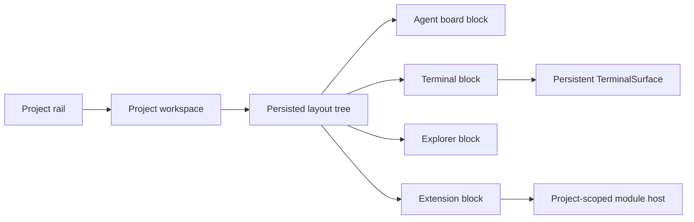

# Modular Workspace Blocks

## Intent

Let a project workspace become a user-arranged canvas of independently useful
views. A person should be able to keep an agent board beside a terminal, move
Explorer below it, or pin a project extension alongside core tools without
turning the entire application shell into a free-form desktop.

The right scope for the first implementation is the **project workspace**.
The global application shell remains stable: title bar, left rail, list pane,
global panels, modals, and notifications retain their current behavior. A
project's workspace body becomes modular when the user opts into it.



## What Exists Today

The project workspace is already the strongest starting point.

- `Workspace.tsx` has a single active `workspaceMode` per project, including
  core views and extension-contributed project tabs.
- `splitLayout` and `splitTabIds` model up to four terminal cells. The UI is
  intentionally disabled, but `TerminalSurface` already preserves a terminal's
  xterm instance while moving its persistent portal node between anchors.
- `ProjectExtensionTab` already mounts an extension panel with a project-scoped
  `ModuleHost`. `AppModule.projectTab` supplies the discovery contract for
  eligible extension panels.
- `AppConfig.workspaceModes` persists per-project view selection through the
  main-owned configuration store. The config normalizer already accepts
  arbitrary extension ids as opaque strings.

The direct consequence: terminal continuity and extension scoping are solved
problems. The missing layer is layout state and a generic block host, not a new
plugin architecture.

## Proposed User Model

`Workspace layout` is a project-local arrangement of blocks.

- A block has a stable id, a view descriptor, and a layout node position.
- Views are from an allowlisted registry: core project views plus extension
  modules that declare `projectTab`.
- A block can be moved by drag-and-drop, resized through split handles, closed,
  duplicated when its descriptor permits it, or reset to a simple default.
- The default remains today's one-view workspace. Existing users do not get a
  new layout until they choose "Customize workspace".
- Layout changes are a local presentation preference. They do not alter project
  files, extension permissions, or terminal processes.

Example initial layouts:

```text
Simple (current behavior)        Investigate                 Operate
+-------------------------+      +-------------+----------+  +----------+----------+
| Agent board / one view  |      | Explorer    | Agents   |  | Agents   | Terminal |
|                         |      +-------------+----------+  |          +----------+
|                         |      | Terminal               |  |          | Extension|
+-------------------------+      +------------------------+  +----------+----------+
```

## Layout Data Model

Use a small recursive split tree rather than a grid library's positional data.
It matches the existing product vocabulary, produces deterministic layouts,
works with keyboard movement, and avoids unbounded overlapping/floating panels.

```ts
type WorkspaceBlockView =
  | { kind: 'core'; view: WorkspaceMode }
  | { kind: 'module'; moduleId: string };

type WorkspaceLayoutNode =
  | { type: 'leaf'; blockId: string }
  | {
      type: 'split';
      direction: 'horizontal' | 'vertical';
      ratio: number; // normalized and clamped, e.g. 0.2..0.8
      first: WorkspaceLayoutNode;
      second: WorkspaceLayoutNode;
    };

interface WorkspaceBlock {
  id: string;
  view: WorkspaceBlockView;
  title?: string;
}

interface ProjectWorkspaceLayout {
  version: 1;
  root: WorkspaceLayoutNode;
  blocks: Record<string, WorkspaceBlock>;
}
```

Persist `workspaceLayouts?: Record<string, ProjectWorkspaceLayout>` in
`AppConfig`, alongside `workspaceModes`. Main validates the JSON **shape and
bounds** on write/read: max leaves (initially 4), known node types, finite
ratios, unique leaf references, no unreferenced block required for rendering,
and string size limits. Main should not validate whether an extension is
currently installed; the renderer resolves that dynamically and shows a
recoverable unavailable-block state.

This is intentionally configuration, not extension storage. The host owns the
window composition, and an uninstalled extension must not lose the user's
other blocks or corrupt the layout.

## Block Registry And Host

Create a renderer-only registry which converts a safe descriptor into a block.
It is the one composition point for core and extension project views.

```ts
interface WorkspaceBlockDefinition {
  id: string;
  title: string;
  icon: LucideIcon;
  mountPolicy: 'active-only' | 'keep-alive';
  supportsMultiple: boolean;
  render(project: Project, blockId: string): ReactNode;
}
```

Core definitions cover Agents, Explorer, Library, Scheduler, Goals,
Follow-ups, Feed, and Terminals. A module definition is available only when a
merged `AppModule` has `projectTab` and `panel`.

`WorkspaceBlockHost` owns:

- Panel chrome: title, focused state, move menu, close action, resize handles.
- Per-block `ErrorBoundary` so a broken extension cannot take down another
  block or the workspace canvas.
- A project-scoped module host for extension leaves, reusing the behavior in
  `ProjectExtensionTab`.
- Empty/unavailable state for a stale module id, with "Remove block" and
  "Replace block" actions.
- An anchor for persistent views, rather than a new instance of those views.

Do not let extensions declare their own CSS grid placement, DOM ids, or drag
targets. They render inside a host-owned block body and only fill available
space. This continues the existing `.module-panel-slot` ownership principle.

## Terminal-Specific Design

Terminals are the primary architectural constraint. They must preserve the
single `TerminalSurface` and one-xterm-per-session invariant.

Replace the fixed `PROJECTS_TERMINAL_ANCHOR_ID` with a block-aware anchor. The
layout resolver identifies the visible terminal block and passes its `blockId`
to `TerminalSurface`; the surface moves its one persistent portal node to
`cc-terminal-anchor-<blockId>`. It does not portal directly to changing React
containers, so scrollback is retained exactly as it is today.

For phase one, allow at most one Terminals block per project. Inside that block,
reuse the existing terminal tab bar and existing terminal split layout. This
avoids deciding immediately how two terminal blocks divide the same session
list. A later phase can either support independent terminal groups or replace
the inner terminal split grid with block-level terminal leaves.

## Interaction Model

Use explicit, accessible layout operations before pointer drag-and-drop:

- Add block from a `+ Add block` menu.
- Split focused block right or below.
- Move focused block left, right, up, or down where a neighboring leaf exists.
- Close block, replace unavailable block, reset project workspace.
- Resize an adjacent split with pointer drag and keyboard buttons.

These operations should be first-class store actions. Pointer drag-and-drop can
then become a thin UI layer that translates a drop target into the same
operations. This avoids making correctness or keyboard use depend on a drag
library.

If a drag implementation is added, use native pointer events with a lightweight
drop overlay or a small, focused dependency. Do not introduce a dashboard/grid
package as the persistence authority. The layout tree remains the product model.

## Mounting And Resource Policy

Keep-alive is necessary only for blocks whose state is expensive or externally
backed:

- Terminals: always keep alive through the existing `TerminalSurface` portal.
- Explorer/Monaco: preserve only while its block remains present; do not keep a
  removed Explorer alive.
- Extension panels: default to active-only initially. A module's `background`
  component already supports deliberate long-lived work. Do not accidentally
  turn every visible extension panel into a permanent process.
- Agent board and simple data views: normal React mount lifecycle is adequate.

The block host should not render all alternate workspace modes hidden in the
DOM. It mounts leaves in the active layout tree only. This bounds memory and
prevents inactive extension panels from retaining subscriptions.

## Incremental Delivery

### Phase 0: Extract without behavior change

- Extract today's workspace mode rendering into a registry/host behind the
  existing single-view `Workspace` UI.
- Teach `TerminalSurface` to accept an anchor id, keeping the default existing
  anchor.
- Move `ProjectExtensionTab` scoping into the generic block host.
- Add unit tests for descriptor resolution and unavailable modules.

### Phase 1: Persisted two-block split

- Add `workspaceLayouts` to `AppConfig`, main normalization, renderer hydration,
  debounced persistence, and unit tests for malformed layouts.
- Support one root split with Agents/Explorer/Terminals/core extension leaves.
- Ship Add, Close, Reset, split direction, and pointer/keyboard resize.
- Keep the existing mode selector as a "single block" shortcut and migration
  path, translating it to a one-leaf layout only when a layout is first created.

### Phase 2: Tree operations and pointer rearrangement

- Generalize to up to four leaves with the recursive split tree.
- Add directional move actions and draggable block headers.
- Implement restore behavior for disabled/uninstalled extensions.
- Add a small preset menu: Simple, Investigate, Operate.

### Phase 3: Optional advanced behavior

- Assess independent terminal groups, detachable block windows, and saved
  named layouts only after usage validates the base model.
- Add extension metadata only if there is a concrete need, for example a
  module-declared minimum size or a preferred default placement. Keep it
  advisory and host-enforced.

## Risks And Guardrails

- Do not replace the full app shell grid. Its nav/list/content placement has
  numerous view-specific contracts. Modularize only `Workspace` first.
- Never treat renderer layout data as authorization. It only controls layout;
  main retains all project/path/capability enforcement.
- Bound blocks to four initially. More cells reduce the terminal and code-view
  experience sharply on laptop screens.
- Clamp ratios and reset malformed layouts rather than letting an invalid saved
  preference make a workspace unusable.
- Preserve extension isolation: every module leaf needs an `ErrorBoundary` and
  a disposal scope on unmount.
- Test narrow widths. At a minimum width, collapse split siblings to tabs or
  display an intentional one-at-a-time layout selector; never render unusable
  200px terminal/editor cells.

## Suggested First Slice

Build Phase 0 plus the Phase 1 two-block split. It gives the core benefit
(Agents + Terminal, Explorer + Terminal, extension + core side by side) while
reusing the codebase's current terminal portal and project-tab module contract.
It also leaves the current single-view behavior as the default and provides a
safe rollback: removing `workspaceLayouts[projectId]` restores today's view.
