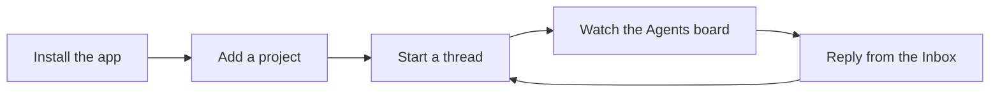

# Getting started

Zana Command Center (ZCC) turns supported coding harnesses into a
**multi-project cockpit**: run many agent sessions at once, see which ones
need you versus which are still working, reply to them, and drive multi-agent
workflows — all from one window.

This guide takes you from a fresh install to your first orchestrated agent in
about five minutes. **New Chat** defaults to a **Thread** with the native CLI
for Claude Code, Cursor, OpenCode, Codex, or Pi — not a generic chat wrapper.
**CLI Agent** is still there when you want a real PTY.

---

## 1. Install

Download the app from the [**Download**](/download/) page and open it. macOS is
available today; Windows and Linux are on the way.

**Prerequisites:** [Node](https://nodejs.org) 20 or newer on this Mac, `git`,
and at least one supported harness CLI on your `PATH`: Claude Code, Cursor,
OpenCode, Codex, or Pi. If the harness works in your terminal, ZCC can launch
it. Remote execution hosts need **Node 22+** — see
[Using Zana on multiple machines](/docs/multiple-devices/).

On first launch the app opens to an empty cockpit — no projects yet. That's the
next step.

---

## 2. Add your projects

A **project** is a folder ZCC watches. It can live on this computer, on an
**enrolled machine**, or on an SSH host. Each one becomes a lane with its own
terminals, agents, and file explorer.

- Click **Add project** in the sidebar.
- Point it at a local folder, pick an enrolled machine and browse its disk, or
  add a remote SSH box.
- Repeat for every codebase you work in — they all live in the same window.

Enrolled machines are paired from **Settings → Machines** (a host daemon on the
other box). SSH remotes stay a separate path. See
[Using Zana on multiple machines](/docs/multiple-devices/).

You can group projects by category in the sidebar so a large fleet stays
navigable.

---

## 3. Start your first session

Open **New Chat** in the sidebar. The composer defaults to **Thread** — a
conversation with the selected harness in the project you pick.

- Choose a project. On a local git repo the composer can also open a
  **New worktree** instead of sharing the checkout. See
  [Environments](/docs/using-zana/#environments).
- Type your task and send. The thread starts in that directory so the harness
  sees the right files.
- Switch to **CLI Agent** when you want a real PTY running the native CLI.
- **Autonomous Team** launches a saved team of personas when the work needs
  parallel roles.

The difference is that you're not limited to one. Start several across
different projects and they run in parallel.

---

## 4. Watch the Agents board

The **Agents board** shows every running session at a glance, grouped by
status:

| Status | Meaning |
| --- | --- |
| **Needs you** | The agent asked a question or is blocked on a decision. |
| **Working** | Actively running — no action needed. |
| **Idle** | Finished a turn and waiting for your next instruction. |
| **Done** | The session has ended. |

Instead of tabbing between terminals to see who's stuck, you glance at the
board and go straight to the one that needs you.

---

## 5. Close the loop from the Inbox

The **Inbox** is where agents surface things you should see — finished
analyses, questions, and reports. When an agent asks a question, it appears as
an inbox entry.

- Open the entry, read the context, and **reply right there**.
- Your answer routes straight back to the waiting agent, as if you'd typed it
  at that session's prompt.
- An **AI Summary** card digests recent activity so a busy inbox stays
  readable.

This is the core loop: **make the wishes, the work gets done.** You stay the
executive — spawning work, answering the few things that need a human, and
letting the agents carry the rest.

---

## Where to go next

- **[Using Zana Command Center](/docs/using-zana/)** — a fuller tour of the
  Inbox, Agents, Teams, and the day-to-day workflows.
- **[Using Zana on multiple machines](/docs/multiple-devices/)** — pair another
  computer from Settings → Machines (public origin / relay; Tailscale Serve
  remains a fallback when no relay token is set).
- **[The `zcc` CLI](/docs/cli/)** — a command-line companion that reads the
  same stores and can drive the running app.
- **[Plugins overview](/docs/extensions/)** — add panels, tabs, commands,
  personas, and teams without editing core.
