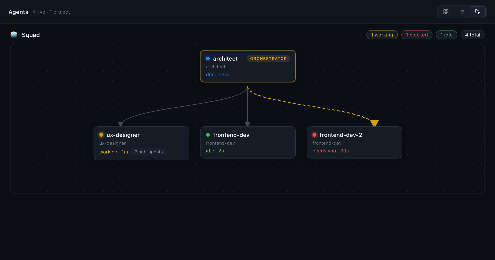
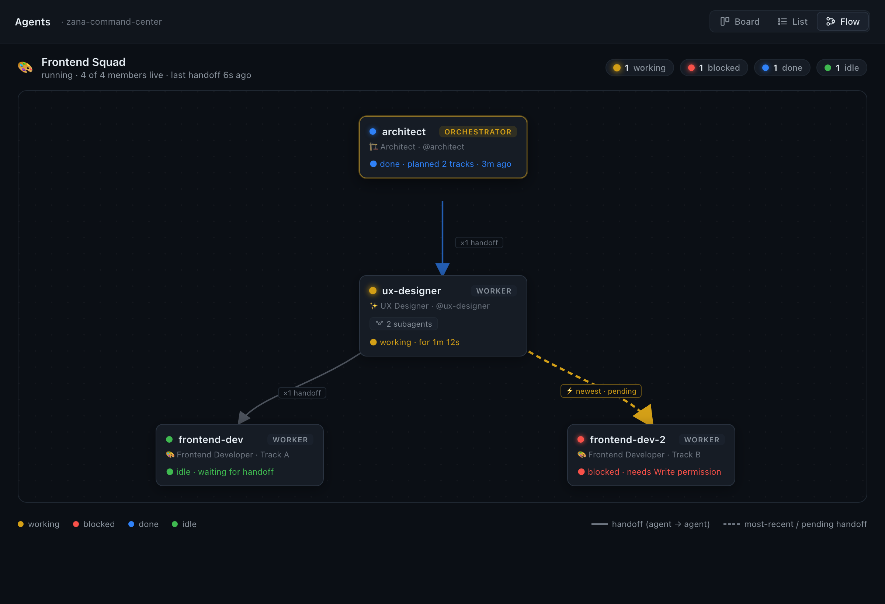
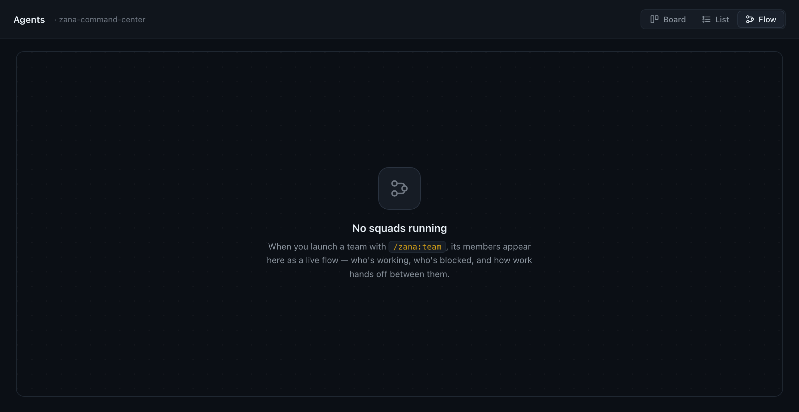

# Squad Flow view — mockups

> **Status: implemented.** This is now shipped code (`SquadFlowView.tsx` +
> `squadFlow.ts` + `squad-flow-*` CSS), not just a design. The image below is
> rendered from the exact shipped class names + layout constants. Typecheck,
> 1488 tests, and the production build all pass. See
> [`squad-flow-architecture-plan.md`](../squad-flow-architecture-plan.md).

## 0. As shipped (rendered from the real CSS + layout)

Orchestrator centered on top, workers in the row below, directed handoff arrows
(newest = dashed gold), live status dots, `N sub-agents` badge, live rollup, and
the new **Flow** toggle (rightmost, active) beside Board / List.

---

## 1. Earlier design mockup (Frontend Squad you ran)

- 🏗️ `architect` — orchestrator (gold-outlined), ● done
- ✨ `ux-designer` — ● working, with a **2 subagents** badge
- 🎨 `frontend-dev` — ● idle · 🎨 `frontend-dev-2` — ● blocked
- directed arrows = handoffs; newest one dashed gold ("⚡ newest · pending")
- new **Board · List · Flow** toggle top-right + status rollup

## 2. Empty state

