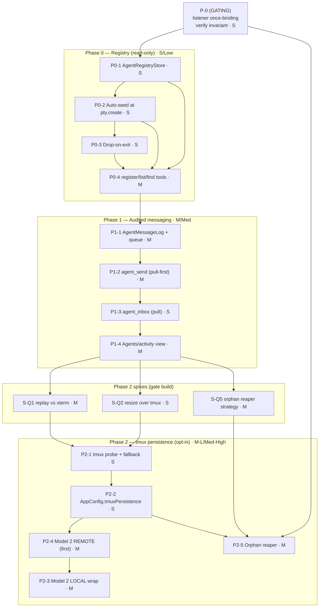

# tmux Substrate + Inter-Agent Mesh — Implementation Plan

**Date:** 2026-06-14
**Source of truth:** `docs/tmux-agent-mesh-review.md` (3-voice review verdict).
**Companion:** the tracked ticket board (24 atomic tickets) — see §9.

## 1. Scope recap

Two concepts, three phases:

- **Agent mesh** (Phase 0 + 1): a thin layer — one new store family + 5 MCP tools — letting independently-launched, user-launched top-level sessions discover and (opt-in, audited) message each other. **Reuse ZCC plumbing; no daemon, no Zana/CU import.**
- **tmux persistence** (Phase 2): Model 2 only (`tmux new-session -A` *behind* node-pty), opt-in, default-off, remote-first, graceful Windows/absent fallback, gated on 3 spikes. **Persistence/detach only — never sold as performance.**

### Load-bearing rule: channel separation (do not violate)

There are **two distinct channels**, and conflating them is the single most important failure mode:

| Channel | Store | Direction | Surface |
|---|---|---|---|
| **User inbox** (`inbox_push` / `InboxStore`) | existing | **agent → User only** | the pilot's actionable inbox |
| **Agent mesh** (`agent_send` / **new** `AgentMessageLog` / `~/.zcc/agent-messages.jsonl`) | NEW | **agent ↔ agent** | a separate Agents/activity view |

`agent_send` **MUST NOT** call `InboxStore.append`. Routine peer traffic lands only in `AgentMessageLog`. The mesh touches the user inbox **only** on a genuine human-in-the-loop event: (a) the first-`agent_send` permission prompt (surfaced by the CLI's own permission flow), and (b) an explicit "blocked — need a human" escalation. Every Phase 1 code review should grep that `agent_send`'s handler never imports/uses `inboxStore`.

---

## 2. Prerequisite (GATING) — listener once-binding invariant

**Source:** `docs/review-consensus-2026-06.md` finding #1.

**Correction from code-reading:** `wireBridgeListeners()` (`src/main/index.ts:518–549`) is **already** correctly bound once for the process lifetime via the `bridgeListenersWired` guard, and is called from boot (`index.ts:1859`), **not** from `createWindow()`. That is the fixed shape today. So this prereq is **verify-and-guard the invariant**, not a fix.

The hazard: any *new* logic we hang off `ptys.on('exit')` (registry-drop in Phase 0, tmux reaper teardown in Phase 2) **must be added inside `wireBridgeListeners()`** (or another once-bound site), never inside `createWindow()` or any re-entrant path.

**Work item P-0 (gating, effort S):**
- **Verify & document** the once-binding invariant before any mesh/tmux exit-hook lands. Confirm `bridgeListenersWired` still guards every new subscription; confirm no new `ptys.on(...)` / `agentStatus.on(...)` call is introduced in `createWindow()` or any handler that can re-run.
- **File:** `src/main/index.ts` (`wireBridgeListeners`, `createWindow`).
- **Test:** `src/main/__tests__/bridge-listeners.test.ts` (new) — call the bridge wiring twice (simulating a window reopen), assert `ptys.listenerCount('exit')` and `ptys.listenerCount('data')` stay at 1. This is the regression guard for the whole plan; every later exit-hook rides on it.
- **Acceptance:** a second `wireBridgeListeners()` call is a no-op; exit/data/sessionUpdated listener counts never exceed 1 across simulated reopens.

This item **blocks** P0-3 (registry drop-on-exit) and P2-5 (reaper teardown).

---

## 3. Phase 0 — Registry (read-only discovery)

**Goal:** auto-seeded, discoverable registry + `register_agent` / `list_agents` / `find_agent`. No messaging. Effort **S**, Risk **Low**.

### P0-1 — `AgentRegistryStore` (clone the inbox-store pattern) · S
- **Create:** `src/main/agent-registry-store.ts`. Mirror `src/main/inbox-store.ts`: a `createAgentRegistryStore(opts)` factory + `createMemoryAgentRegistryStore()` for tests. EventEmitter + optional JSONL at `~/.zcc/agents.json`, in-process mutex, atomic tmp+rename. In-memory map keyed by `sessionId` is the source of truth; on-disk file is best-effort (records dropped on exit anyway).
- **Record shape:**
  ```ts
  interface AgentRecord {
    sessionId: string;   // PK — from the URL route, server-filled
    projectId: string;   // from the URL route, server-filled
    handle: string;      // agent-chosen, deduped per project
    role?: string;
    capabilities?: string[];
    cwd: string;         // from PtyManager.getSession(), server-filled
    registeredAt: number;
  }
  ```
  Live `status` is **NOT** stored — it's read on demand from `AgentStatusTracker.get(sessionId)` at response time, so it's never stale.
- **Test:** `src/main/__tests__/agent-registry-store.test.ts` — upsert fills server fields; handle dedup per project; `find` by role/capability; `drop` removes; `onChanged` fires.

### P0-2 — Auto-seed at `pty.create` (Q4: CONFIRMED YES) · S
- **Edit:** `src/main/index.ts` boot wiring. `pty.create` (`pty.ts:484–504`) already emits `sessionUpdated`. **Do not couple the store into `pty.ts`.** In `wireBridgeListeners()`, subscribe to `ptys.on('sessionUpdated')` and, **for claude-family profiles only** (default), pre-seed an `AgentRecord` with a default handle so the session is discoverable even if the agent never calls `register_agent`.
- **Test:** a claude `sessionUpdated` seeds a record; a shell session does not (default policy); seeding is idempotent.

### P0-3 — Drop-on-exit (depends on P-0) · S
- **Edit:** `src/main/index.ts` — inside the existing `ptys.on('exit')` handler in `wireBridgeListeners()` (`index.ts:529–533`, alongside `agentStatus.remove(sessionId)`), add `agentRegistry.drop(sessionId)`.
- **Test:** simulate exit, assert record removed; no leak after N reopen cycles.

### P0-4 — Three discovery MCP tools (mirror the tool-factory pattern) · M
- **Create:** `src/main/agent-registry-mcp-tools.ts` (three `registerXTool` factories), modeled on `inbox-mcp-tool.ts` / `register-project-mcp-tool.ts`. Schemas expose **only** agent-suppliable fields; `sessionId`/`projectId`/`cwd` closed over from the route + `PtyManager.getSession()` (un-forgeable, the `inbox_push` trust model).
  - `register_agent({ handle, role?, capabilities? })` → `agentRegistry.upsert(...)`.
  - `list_agents({ allProjects? })` → default scope = own project; fuse live `status`.
  - `find_agent({ handle?, role?, capability? })` → resolve; same default scope.
- **Edit:** `src/main/mcp-server.ts` `buildProjectMcpServer` (`:111–156`) — register on the **session-scoped route only** (guard on `opts.sessionId`, like `schedule_report`). Inject `agentRegistry`, `getSessionCwd`, `getAgentStatus` callbacks (keep module Electron-free).
- **Edit:** `src/main/index.ts` `startMcpServer({...})` (`:1712`) — pass the new callbacks.
- **Edit:** `src/main/pty.ts` — add the three tools to pre-approved `inboxAllow` (`:403–407`). **Leave `agent_send` out.** Extend `INBOX_USAGE_GUIDANCE` (`:61–93`) or add `AGENT_MESH_GUIDANCE` teaching the tools exist.
- **Test:** handler unit tests (server-filled identity cannot be overridden; own-project default; `find` filters) + route registration test.

**Phase 0 exit:** discovery works end-to-end, read-only; no messaging path exists; user inbox untouched.

---

## 4. Phase 1 — Audited messaging

**Goal:** `agent_send` (pull-queue source of truth + inject-when-idle) + `agent_inbox` (poll), mandatory append to `AgentMessageLog`, prompt-on-first-send, same-project scope. Effort **M**, Risk **Med**. Depends on **all of Phase 0**.

### P1-1 — `AgentMessageLog` + per-target pull queue · M
- **Create:** `src/main/agent-message-log.ts`. Clone the `inbox-store.ts` JSONL+mutex+atomic pattern; persist to `~/.zcc/agent-messages.jsonl` (**distinct file from the inbox**). Serves two roles: (a) immutable audit log of every send, (b) per-target pull queue (delivery source of truth).
  ```ts
  interface AgentMessage {
    id: string; ts: number;
    fromSessionId: string; fromHandle: string;
    toSessionId: string; toHandle: string;
    projectId: string;
    body: string;
    deliveredAt?: number;  // set when injected or pulled; absent = still queued
  }
  ```
- **Test:** append+pull round-trip; `since` cursor; `markDelivered`; concurrent appends don't drop (reuse inbox-store mutex test template — inherits the serialize-appends lesson from consensus finding #2).

### P1-2 — `agent_send` MCP tool · M
- **Create:** `src/main/agent-send-mcp-tool.ts`. Schema `{ to, message }`. Handler (server-filled `from*`/`projectId`):
  1. Resolve `to` via `agentRegistry.find` (default same-project; cross-project needs explicit opt-in).
  2. **Always** `agentMessageLog.append(...)` — non-negotiable audit. **Never** `inboxStore.append`.
  3. Read `agentStatus.get(toSessionId)`; if `idle`/`done` → `ptys.reply(toSessionId, "[from @handle] …")` + `markDelivered`. Else queue only.
- **Pull-first is the safety net (Q3):** `AgentStatusTracker.get()` is debounced ~250ms (`agent-status.ts:37`), so the idle-gate can be ~250ms stale. Because the queue is source of truth, a stale-gate misfire only means "queued instead of injected" — never lost. **Inject is best-effort; do not make it the delivery guarantee.**
- **Edit:** `mcp-server.ts` register session-scoped; `index.ts` wire callbacks. **Do NOT** add to `inboxAllow` (Q6).
- **Test:** idle → `reply()` + delivered; working → queued, `reply()` not called; **assert handler never references `inboxStore`**; cross-project rejected unless opt-in.

### P1-3 — `agent_inbox` (pull) MCP tool · S
- **Create:** `src/main/agent-inbox-mcp-tool.ts`. Schema `{ since? }`; returns `agentMessageLog.pull(sessionId, since)` then `markDelivered`. Register session-scoped; add to `inboxAllow` (read tool, safe). Extend `AGENT_MESH_GUIDANCE` to teach polling.
- **Test:** pull returns queued-not-delivered; cursor advances; pulled flips to delivered.

### P1-4 — Agents/activity view (renderer surface) · M
- **Edit:** `src/shared/ipc.ts` — add an `agents` channel block mirroring `inbox` (`:68–75`): `history`, `onAppended`, `list`. Main handlers in `index.ts` backed by `agentRegistry.list` + `agentMessageLog`. Renderer store slice + panel (mirror the inbox UI; natural home: existing `AgentsView.tsx` / `GlobalAgentsBoard.tsx`). **This is the user-visible audit surface that makes the mesh pass the cockpit bar.**
- **Test:** renderer store slice test + main IPC handler test.

**Phase 1 exit:** audited, opt-in, pull-first messaging on its own channel; user inbox provably untouched by peer traffic; first send gated by a permission prompt.

---

## 5. Phase 2 — tmux persistence (opt-in, remote-first) — GATED ON 3 SPIKES

**Goal:** Model 2 only, `AppConfig.tmuxPersistence` default off, graceful fallback when tmux absent, remote-first then local, orphan reaper. Effort **M–L**, Risk **Med–High**. Build **last**.

### Spikes (time-boxed, gate Phase 2 build)

| Spike | Question | Box | Pass criteria |
|---|---|---|---|
| **S-Q1** | Re-attach scrollback replay vs single-xterm | 1 day | Drive a real `tmux attach` into the single-mount xterm portal. Confirm the 8ms coalescer (`pty.ts:20`) absorbs the replay burst, and whether re-attaching into a **fresh** xterm renders clean vs an **existing** one double-draws. **Pass:** clean render on fresh-xterm re-attach, no duplicated scrollback. |
| **S-Q2** | `proc.resize()` over a tmux client | 0.5 day | Single-client `resize()` (`pty.ts:670`) tracks the tmux window; document multi-attach size-fight caveat. **Pass:** single-client resize tracks; caveat documented. |
| **S-Q5** | Orphan tmux reaper | 1 day | **Key constraint discovered:** the restore snapshot `cc.openSessions` lives in **renderer localStorage** (`src/renderer/util/sessionRestore.ts:19`), **not** readable by main. The reaper cannot reconcile against it at boot directly. Design must either (a) have the renderer hand the snapshot to main via IPC on boot before reaping, or (b) reap conservatively (kill only `cc-*` sessions with no matching live pty after a grace window). **Pass:** a documented strategy that never kills a session being restored. |

### Build items (only after spikes pass)

### P2-1 — tmux availability probe + graceful fallback · S
- **Create:** `src/main/tmux.ts` — `isTmuxAvailable()` (check `tmux` on `PATH`; **always false on `win32`**, mirroring `src/main/env.ts:72`). Cached.
- **Test:** win32 → false; mocked PATH hit/miss.

### P2-2 — `AppConfig.tmuxPersistence` flag (default off) · S
- **Edit:** `src/shared/types.ts` (`AppConfig`, ~:317) add `tmuxPersistence?: boolean`. Settings UI toggle. **Pitch copy: "survive app restart / network blips" — never "faster/lighter."**

### P2-3 — Model 2 command wrapping in `pty.create` (LOCAL) · M
- **Edit:** `pty.ts` `create()` (`:476`) — when `config.tmuxPersistence && isTmuxAvailable() && !opts.headless && !opts.scheduled`, wrap into `tmux new-session -A -s cc-<sessionId> -- <command> <args>` **without touching anything downstream** (env still injects via pane child; onData/write/resize/coalescing/cap unchanged). `cc-<sessionId>` is the reaper's match key.
- **Test:** flag on + tmux mocked → spawn args contain the tmux wrap; flag off OR tmux absent → original command; headless/scheduled always bypass.

### P2-4 — Model 2 for REMOTE (build first within Phase 2) · M
- **Edit:** `pty.ts` `createRemote`/`buildRemoteCmd` (`:564`, `:916`) — wrap the remote exec in `tmux new -A -s cc-<sessionId>` on the remote, behind the existing `ssh -t`. **Strongest use case** (survive flaky SSH), lower effort, no identity-URL interaction (remote skips MCP injection).
- **Test:** remote command string contains the tmux wrap when the flag is on.

### P2-5 — Orphan reaper (depends on P-0 + S-Q5) · M
- **Edit:** `index.ts` — boot-time reaper hooked into the `.mcp.json` backfill boot path (`:1845–1853`), per the S-Q5 strategy. **Any exit-time tmux teardown must go inside `wireBridgeListeners()`'s `ptys.on('exit')`** — never `createWindow()`.
- **Test:** mocked `tmux ls`; restored sessions kept, rest killed; binds once across simulated reopens.

**Phase 2 exit:** opt-in persistence works remote + local; absent-tmux/Windows fall back cleanly; no orphan leak; honest "persistence not performance" framing in the UI.

---

## 6. Open PM decisions (not code questions)

1. **Auto-seed all sessions vs opt-in?** Recommendation: **auto-seed all claude-family sessions** (discovery is useless if half the fleet is invisible; record is cheap, dropped on exit). Toggles the gate in **P0-2**.
2. **`agent_send` permission default.** Recommendation: **prompt-on-first-send** (leave it out of `inboxAllow`, Q6). Wired in **P1-2**; reversing it is a one-line change.

---

## 7. Dependency graph



---

## 8. Critical files

Existing: `src/main/pty.ts`, `src/main/mcp-server.ts`, `src/main/index.ts`, `src/main/inbox-store.ts`, `src/main/agent-status.ts`, `src/shared/ipc.ts`, `src/shared/types.ts`, `src/renderer/components/AgentsView.tsx` / `GlobalAgentsBoard.tsx`.

New: `src/main/agent-registry-store.ts`, `src/main/agent-registry-mcp-tools.ts`, `src/main/agent-message-log.ts`, `src/main/agent-send-mcp-tool.ts`, `src/main/agent-inbox-mcp-tool.ts`, `src/main/tmux.ts`.

---

## 9. Tracked tickets

The work is split into **24 atomic tickets** (each ≈ one focused PR), tracked in the task list and grouped into three sprints:

- **Phase 0 sprint** (discovery, shippable alone): prereq #1 → store, auto-seed, drop, discovery tools, pre-approval, read-only Agents view, tests/docs.
- **Phase 1 sprint** (audited messaging): `AgentMessageLog`, pull-queue, `agent_send`, `agent_inbox`, prompt-on-first-send gate, system-prompt guidance, activity view, tests/docs.
- **Phase 2 sprint** (tmux, gated): 3 spikes first → flag + fallback, remote wrap, local wrap, orphan reaper, honest-framing docs.

Ticket #1 (verify the listener once-binding invariant) blocks exit-hook work in Phases 0 and 2, so it lands first regardless of sprint.
