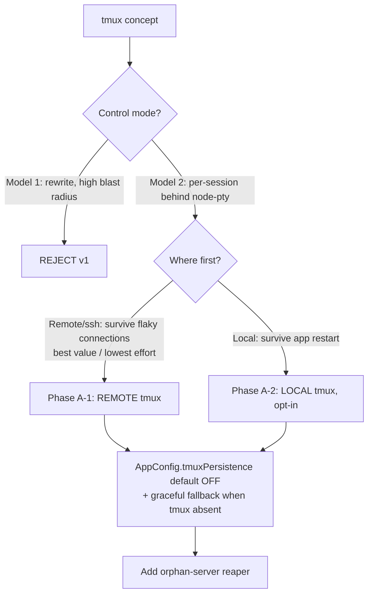
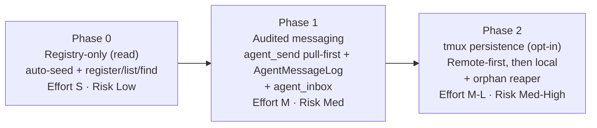

# tmux Substrate + Inter-Agent Discovery & Messaging — Review

**Date:** 2026-06-14
**Team:** PM → Architect → Engineer (3-voice review)
**Subject:** Two proposed concepts for Zana Command Center (ZCC):
1. Use **tmux** behind the scenes — does it actually improve app performance?
2. **Inter-agent discovery + optional messaging** — let independently-launched agents reference, find, and message each other.

**Verdict (one line):** tmux is a **persistence/detach** feature mis-sold as performance — ship it opt-in, remote-first, never as "faster." The agent mesh is a **genuine, cheap win** that the existing per-session-MCP / `reply()` plumbing already 80% supports — build it Phase 1 as a registry + audited pull-messaging on its **own** agent↔agent channel (the user inbox stays agent→User only), not an autonomous mesh.

---

## PM framing (cockpit-first)

ZCC is **the human's interactive cockpit**, not an autonomous fleet — that's an adjacent layer, not a rival. Every feature is judged against: *does it keep the human in the loop, visible and in control?* The strategic rule from prior work holds: **reuse ZCC's own plumbing, do not drag in a daemon model** — the app is explicitly "no daemon" (`scheduler.ts:84`, ptys die on quit).

That framing decides both questions:
- **tmux** must not become a hidden always-on daemon the user can't see. It's acceptable only as an opt-in that the user understands as "my sessions survive a restart / a dropped SSH."
- **Agent messaging** must not become a hidden mesh where agents talk behind the user's back. Every cross-agent message must be **auditable in a user-visible surface** (an Agents/activity view backed by a dedicated agent-message log) and attributable to a real session the user launched. **It must NOT reuse the user inbox** — the inbox (`inbox_push`) is strictly the **agent → User** channel for things the human must act on; mirroring agent↔agent chatter into it would pollute the one surface reserved for the pilot's own decisions. The mesh touches the user inbox **only** when something genuinely needs the human (a permission prompt on first send, or an agent escalating that it's blocked).

Both concepts pass that bar *only* in the constrained forms recommended below.

---

## PART A — tmux as substrate

### Architecture (two models)

The architect evaluated two integration models. Summarised, with the engineering reality-check folded in:

| Model | What it is | Verdict |
|---|---|---|
| **Model 1 — control mode (`tmux -CC`)** | One control connection; panes = sessions; app demuxes `%output`/`%window-add`/`%layout-change` | **Reject for v1.** Full rewrite of the core runtime. |
| **Model 2 — tmux per session behind node-pty** | Keep `PtyManager` shape; only change the spawned command to `tmux new-session -A -s <name> -- <command> <args>` | **Recommended, opt-in, remote-first.** Minimal diff. |

### Engineering reality-check — why Model 1 is a rewrite

Confirmed against `pty.ts`:

- Every session today is an **independent `pty.IPty`** with its own `onData`/`onExit`/`resize`/`write` (`pty.ts:476–549`). Control mode collapses all of that into **one stream** the app must demux and re-route into the existing per-session coalescing buffers (`bufferData`/`flushData`, `pty.ts:149–177`).
- **Identity is baked into per-session env at spawn** — `ZCC_MCP_URL`, `ZCC_HOOK_URL`, `ZCC_NOTIFY_URL`, `ZCC_FIRSTPROMPT_URL`, each carrying `projectId/sessionId` in the URL (`pty.ts:457–474`). In a *shared* tmux server, panes don't get independent spawn-time env injection the way separate `pty.spawn()` calls do. This is the load-bearing security boundary (URL-as-identity, `mcp-server.ts:6–16`) and control mode would force a redesign of it.
- The 50-session cap, the 8ms coalescer, the agent-status detector reading the raw stream (`index.ts:527`) — all assume the one-pty-per-session shape.

**Blast radius: high. Confirmed NOT recommended for v1.**

### Model 2 is a genuinely small diff — confirmed

Model 2 changes only the *command* handed to `pty.spawn`. Everything downstream — `onData`, `write`, `resize`, coalescing, IPC, env injection (inherited by the pane's child) — is untouched because node-pty is still the client. The engineer confirms this maps cleanly onto `pty.create` (`pty.ts:476`): wrap `command`/`fullArgs` into `tmux new-session -A -s cc-<sessionId> -- <command> <args>`. The env still injects (the pane process inherits it). The cap still counts (each tmux client is still a `node-pty` + a real process).

### Performance truth table

The central PM question — *"does tmux improve app performance?"* — answered honestly per claimed benefit, grounded in this codebase:

| Claimed tmux benefit | Label | One-line reason (grounded in code) |
|---|---|---|
| **Process survival across app restart/crash** | ✅ **CONFIRMED** | Today `before-quit → ptys.killAll()` (`pty.ts:708`) kills everything; restore re-spawns via `--continue`/`--resume` (`memory/session-restore-design`). tmux server survives quit → re-attach preserves the *live* process + in-memory conversation. This is the **only real win.** |
| **Detach / reattach a running session** | ✅ **CONFIRMED** | Impossible today — there is no daemon; the pty's lifetime == the app's. tmux makes it possible. |
| **Faster per-session spawn** | ❌ **MYTH (neutral-to-negative)** | A tmux pane is not cheaper than a `node-pty`, and you *still* pay the dominant cost — the `claude` Node child tree. tmux **adds** a server + client process. |
| **Smoother xterm rendering** | ❌ **MYTH** | Rendering cost is the renderer's xterm canvas (`memory/terminal-surface-single-mount-portal`), entirely untouched by how the process is spawned. |
| **Reduces IPC flood from chatty commands** | ❌ **MYTH — ALREADY SOLVED** | The 8ms per-session coalescer (`PTY_DATA_FLUSH_MS`, `pty.ts:20, 149–177`) already collapses bursts into ~one IPC message/frame. This was independently identified as P1 and **shipped** (`docs/architecture-review.md:94`). tmux re-attach *adds* a scrollback **replay burst** the coalescer must now absorb. |
| **Lower Electron memory** | ❌ **MYTH (worse)** | Net neutral-to-worse — tmux server RSS is added on top of every existing process. |

**Bottom line:** the bottleneck is **IPC/render (already mitigated) + the claude child tree** — *not* pty spawn. **tmux's value is persistence/detach only. Do not sell it as "faster" or "lighter."**

### New costs tmux introduces (engineer)

1. **Binary dependency, not an npm package.** `node-pty`, `@xterm/*`, `better-sqlite3`, `@modelcontextprotocol/sdk` are all in `package.json`; **tmux is not** — it's an external binary, **absent on Windows** and not guaranteed on every Mac/Linux. Any tmux path must degrade gracefully to plain `node-pty` when `tmux` isn't on `PATH`. (The codebase already has a Windows guard precedent — `env.ts:72`, `process.platform === 'win32'`.)
2. **Orphan tmux servers** become a new resource leak class — surviving processes are the *point*, but they need a reaper (open question #5).
3. **Scrollback now lives in tmux *and* xterm** — re-attach replays scrollback as a burst into a single-xterm model that today never replays (open question #1).
4. **Scheduler gains nothing** — headless runs (`scheduler.ts`, `headless:true` + `autoCloseOnFinish`) are short-lived and auto-closed; keep them on plain `node-pty`.

### tmux recommendation



- **No control mode in v1.**
- **Model 2, opt-in**, behind `AppConfig.tmuxPersistence?: boolean` (default **off**), with graceful fallback to plain `node-pty` when `tmux` is not on `PATH`.
- **Land REMOTE tmux first** — the strongest use case (survive a flaky `ssh -t`; `tmux new -A` on the remote behind the existing SSH in `createRemote`, `pty.ts:564`), and lower effort than local control mode.
- Then local; add the orphan-server reaper.
- **Reframe the pitch as "survive app restart / network blips" — never "faster/lighter."**

---

## PART B — agent registry + message bus

### Stance (PM + Architect aligned)

The user is the **cockpit pilot**: this is **discovery + opt-in, auditable messaging**, *not* a hidden autonomous mesh. Every message is attributable to a real session, is auditable in a user-visible surface, and an agent can only message peers **the user already launched**.

**Channel boundary (corrected — do not conflate):** the user inbox (`inbox_push` / `InboxStore`) is **agent → User only** — the surface for things the *human* must see or act on. Agent↔agent traffic rides **its own** plumbing and is logged to a **separate agent-message log**, surfaced in an Agents/activity view. The mesh writes to the user inbox **only** on a genuine human-in-the-loop moment (permission prompt on first `agent_send`, or an agent escalating "blocked — need a human"). Routine peer messages never enter the user inbox.

### Engineering reality-check — the plumbing already exists

This is the strongest finding of the review: **ZCC already has every primitive the mesh needs.** The proposal is a thin layer (1 store + 5 tools), exactly like `register_project` and `schedule_report` were:

| Mesh need | Already in the codebase | Reuse, don't rebuild |
|---|---|---|
| **Un-forgeable agent identity** | `sessionId` minted at `pty.ts:314`, baked into `ZCC_MCP_URL` (`pty.ts:457`); MCP router closes over `projectId`/`sessionId` from the **URL path**, never from agent input (`mcp-server.ts:111–155`, `inbox-mcp-tool.ts:101`) | Key the registry on `sessionId`; fill `sessionId/projectId/cwd` **server-side** from the route + `PtyManager.getSession()` (`pty.ts:193`). Agent supplies only `handle/role/capabilities`. |
| **Inject a message into a peer** | `PtyManager.reply(id, text)` — writes text then a **deferred CR** (the TUI paste-guard workaround), already used to answer an agent's inbox question (`pty.ts:659–668`) | Route `agent_send` through `reply()`. |
| **Audit surface (visible to user)** | `InboxStore` is the **pattern to mirror, not the store to reuse** — EventEmitter + JSONL at `~/.zcc/`, atomic write (`inbox-store.ts`) | Build a **separate** `AgentMessageLog` (same pattern, e.g. `~/.zcc/agent-messages.json`) for agent↔agent history, surfaced in an Agents/activity view. **Do NOT `InboxStore.append`** — the user inbox is agent→User only. Touch the inbox only for true human-in-the-loop events (first-send permission, blocked-escalation). |
| **Live peer status (for idle-gating)** | `AgentStatusTracker.get(sessionId)` returns `'working'|'blocked'|'done'|'idle'|'unknown'` (`agent-status.ts:145`, `types.ts:238`) | Gate inject on idle/done, queue otherwise. |
| **Lifecycle drop** | `ptys.on('exit')` already removes agent-status (`index.ts:529–533`) | Drop the registry record on the same event. |
| **New main-process store pattern** | `inbox-store.ts` — EventEmitter + JSONL at `~/.zcc/`, in-process mutex, atomic tmp+rename | Mirror it for `AgentRegistryStore` (in-memory + optional `~/.zcc/agents.json`). |
| **Agent-callable MCP tool with a trust gate** | `register_project` (`index.ts:1794–1840`) — agent-supplied input confined server-side to allowed bases | Same pattern for the new tools. |
| **System-prompt guidance teaching a tool** | `INBOX_USAGE_GUIDANCE` appended at spawn (`pty.ts:61–93`) | Teach `agent_inbox` polling the same way. |

**Conclusion: no external orchestration import.** Zana `SendMessage` = in-session subagent fan-out; a daemon-orchestrated-sessions model is a different topology entirely. ZCC's topology — independent, user-launched, long-lived **top-level** sessions, each its own tab/process — is neither. Importing either would drag a daemon model into a no-daemon app. **Reuse ZCC's own plumbing.**

### Design (confirmed sound)

```mermaid
sequenceDiagram
  participant A as Agent A (session A)
  participant MCP as Per-session MCP server<br/>(URL = identity)
  participant REG as AgentRegistryStore
  participant STAT as AgentStatusTracker
  participant LOG as AgentMessageLog (agent↔agent audit)
  participant B as Agent B pty (session B)

  A->>MCP: register_agent(handle, role?, caps?)
  MCP->>REG: upsert {sessionId,projectId,cwd from URL+getSession}
  A->>MCP: find_agent({role:"reviewer"})
  MCP->>REG: resolve -> session B
  A->>MCP: agent_send(to:"reviewer", message)
  MCP->>LOG: append (agent↔agent audit, always) — NOT the user inbox
  MCP->>REG: enqueue to B's pull-queue (source of truth)
  MCP->>STAT: get(session B)
  alt B idle/done
    MCP->>B: reply(text) inject at prompt
  else B working/blocked
    Note over MCP,B: queue only; B reads via agent_inbox(since?)
  end
```

**Registry record** — `{ sessionId (PK, from route), projectId (from route), handle (agent-chosen, deduped per project), role?, capabilities?: string[], cwd (from live session), status (via AgentStatusTracker), registeredAt }`. Server fills `sessionId/projectId/cwd`; agent supplies only `handle/role/capabilities` (same trust model as `inbox_push`).

**Five MCP tools** (new factory files mirroring `inbox-mcp-tool.ts`/`register-project-mcp-tool.ts`, all on the **session-scoped** route `/mcp/:projectId/:sessionId` so identity is always real):
`register_agent` · `list_agents` (default scope = own project) · `find_agent` · `agent_send` · `agent_inbox` (pull).

**Delivery: pull-first, inject-when-idle.** The per-target queue is the source of truth (robust; receiver decides when to read). Inject via `reply()` **only when the target is idle/at-prompt** — and **always** append an audit copy to the **`AgentMessageLog`** (the dedicated agent↔agent surface), **never** the user inbox. The engineer endorses pull-first: it sidesteps the fragility flagged in the open questions below.

### Guardrails (confirmed)

1. Same-project scope by default; cross-project explicit opt-in.
2. **Every send appended to the `AgentMessageLog`** (the non-negotiable audit bar) — a *separate* agent↔agent surface, **not** the user inbox. The user inbox stays reserved for agent→User events; the mesh writes to it only on first-send permission and blocked-escalation.
3. Inject only when target idle, else queue.
4. Pre-approve `register_agent`/`list_agents`/`find_agent`/`agent_inbox` in `inboxAllow` (`pty.ts:403`); **leave `agent_send` NOT auto-approved** so the user sees the first send as a permission prompt (engineer + PM concur — see Q6).

---

## Answers to the architect's 6 open questions

| # | Question | Engineer's answer (from code) |
|---|---|---|
| 1 | tmux re-attach replay vs single-xterm | **SPIKE.** The single-xterm model (`memory/terminal-surface-single-mount-portal`) never replays today; on re-attach, tmux re-sends scrollback. The 8ms coalescer will *absorb* it into fewer IPC messages, but whether it renders cleanly or **double-draws** scrollback the xterm already holds depends on whether restore re-attaches into a **fresh** xterm (clean) or an existing one (risk of duplication). Must spike against a real `tmux attach`. |
| 2 | `proc.resize()` over a tmux client | **SPIKE, likely partial.** `resize()` (`pty.ts:670`) drives the node-pty client; tmux negotiates window size across *all* attached clients to the smallest. With one client it should track; multi-attach (e.g. a stray terminal also attached) causes the classic tmux size-fight / flicker. Acceptable for single-client v1; document the multi-attach caveat. |
| 3 | `reply()` mid-turn safety | **CONFIRMED RISK — gate on idle, as proposed.** `reply()` writes text then a deferred CR 50ms later (`pty.ts:659–668`); the paste-guard is tuned for an *idle prompt*. Injecting mid-turn lands text in the middle of output and can mis-fire the CR. `AgentStatusTracker.get()` exposes the state (`agent-status.ts:145`), but it is **debounced ~250ms** (`EMIT_DEBOUNCE_MS`, `agent-status.ts:37`) — so the gate can be **up to ~250ms stale**. Mitigation: pull-first delivery makes the inject a best-effort *nicety*, not the delivery guarantee, so a stale-gate misfire only means "queued instead of injected" — never lost. **The pull-first design neutralises this risk; do not make inject the source of truth.** |
| 4 | Auto-seed `AgentRecord` at spawn | **CONFIRMED YES.** At `pty.create` (`pty.ts:484–499`) the main process already knows `sessionId`, `projectId`, `cwd`, and `persona` and emits `sessionUpdated`. Main can pre-seed a record there with no agent cooperation; `register_agent` then just enriches `handle/role/capabilities`. **This guarantees discoverability even if the agent never calls the tool** — strongly recommended over agent-driven-only. (PM decision on auto-seed-all vs opt-in below.) |
| 5 | Orphan tmux reaper | **Boot-time scan, as proposed.** On boot, `tmux ls`, match `cc-*` session names, and reconcile against the restore snapshot (`cc.openSessions`, `memory/session-restore-design`): re-attach the ones being restored, kill the rest. Hook it into the same boot path that backfills `.mcp.json` (`index.ts:1846–1853`). **Caveat (engineer):** the registry-drop and any tmux teardown must NOT be hung off the `ptys.on('exit')` listener *inside* `wireBridgeListeners()` without fixing **consensus finding #1** (`createWindow` re-subscribes listeners with no teardown, `docs/review-consensus-2026-06.md`) — or a window reopen will double-register the reaper/drop. Bind it once, process-lifetime, like the existing bridge. |
| 6 | `agent_send` auto-approval | **Product/security call — engineer + PM recommend prompt-on-first-send.** Leave `agent_send` out of `inboxAllow` so the first cross-agent message surfaces a permission prompt. This is the cockpit guardrail in action: the user explicitly blesses agent-to-agent comms once, per the human-in-the-loop stance. The read/discovery tools (`register/list/find/inbox`) are safe to pre-approve. |

**PM decisions still open (not code questions):**
- **Auto-seed all claude sessions vs opt-in?** Engineer recommends **auto-seed all claude-family sessions** (discovery is useless if half the fleet is invisible; the record is cheap and dropped on exit). Opt-in only if the user wants a privacy default.
- **`agent_send` permission default** — recommended prompt-on-first-send (Q6).

---

## Phased recommendation



| Phase | Scope | Effort | Risk | Build? |
|---|---|---|---|---|
| **Phase 0 — Registry (read-only)** | `AgentRegistryStore` (mirror `inbox-store`), auto-seed at `pty.create`, drop on exit, tools `register_agent`/`list_agents`/`find_agent`. No messaging. Delivers the stated core ask ("a way to reference/discover them"). | **S** | **Low** | ✅ **Build first.** |
| **Phase 1 — Audited messaging** | `agent_send` (pull-queue source of truth + inject-when-idle) + `agent_inbox` (poll) + **mandatory append to `AgentMessageLog`** (separate agent↔agent surface, *not* the user inbox) + `agent_send` prompt-on-first-send + same-project scope. | **M** | **Med** | ✅ Build after 0 proves out. |
| **Phase 2 — tmux persistence (opt-in)** | Model 2 only, `AppConfig.tmuxPersistence` default off, graceful fallback when tmux absent, **remote-first** then local, orphan reaper. | **M–L** | **Med–High** | ⚠️ Build last, gated on the 3 spikes (Q1/Q2/Q5). |

### What to NOT build
- ❌ **tmux control mode (Model 1)** — core rewrite, high blast radius.
- ❌ **tmux as a performance play** — it isn't one; IPC is already coalesced and spawn isn't the bottleneck.
- ❌ **An autonomous agent mesh** — no hidden agent-to-agent traffic; everything is logged to the user-visible `AgentMessageLog` and respects the idle-gate.
- ❌ **Routing agent↔agent messages through the user inbox** — the inbox is agent→User only; conflating the two pollutes the pilot's actionable surface. Use the separate `AgentMessageLog`.
- ❌ **External daemon-orchestration import** — wrong topology; would smuggle a daemon into a no-daemon app.
- ❌ **tmux for scheduled/headless runs** — short-lived & auto-closed; no benefit.

---

## Final verdict

**tmux:** A real but *narrow* win — **process survival + detach/reattach**, nothing else. Every performance claim is MYTH or already-solved (the 8ms coalescer shipped that). Build it **opt-in, remote-first, Phase 2**, behind a default-off flag with graceful fallback, and pitch it honestly as "survive restarts and network blips." Reject control mode for v1.

**Agent mesh:** The genuine, cheap win. ZCC already owns every primitive — URL-as-identity, `reply()` inject, the agent-status tracker, the per-session MCP factory pattern, and the `InboxStore` *pattern* (to clone for a dedicated `AgentMessageLog`, not to reuse). Build it as a **thin layer (1–2 stores + 5 tools)**, **Phase 0 registry-first**, then **Phase 1 pull-first audited messaging** with the cockpit guardrails intact. The pull-first delivery model is what makes the debounced-status inject-gate safe (a stale gate degrades to "queued," never "lost"). **Channel discipline is load-bearing: agent↔agent traffic lives in the `AgentMessageLog` / `agent_inbox` queue; the user inbox stays agent→User only.**

**Separating the win from the hype:** tmux = persistence, not speed. Mesh = discovery + audited opt-in messaging, not autonomy. Both ship only in the constrained, human-in-the-loop forms above.
